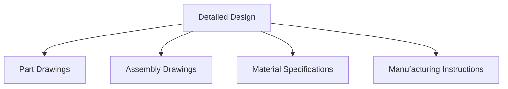
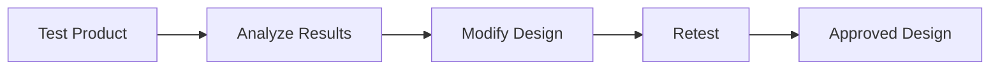

# 📋 Design Process

Machine design is not a single-step activity. It is a systematic process that
transforms an idea into a functional and reliable product.

A proper design process helps engineers reduce errors, improve product quality,
and ensure safety.

---

## Why Follow a Design Process?

Without a structured process:

❌ Components may fail unexpectedly

❌ Manufacturing costs may increase

❌ Product performance may be poor

❌ Safety issues may arise

A design process helps achieve:

✅ Better performance

✅ Higher reliability

✅ Lower cost

✅ Improved safety

## Stages of Machine Design

<!-- Visual flow for 📋 Design Process. -->

## 1⃣ Recognition of Need

Every design begins with identifying a need or problem.

Examples:

- Need for a stronger bridge
- Need for a fuel-efficient vehicle
- Need for an automated production machine

### Example

A factory requires a conveyor system capable of handling heavier loads than
existing systems.

The need is recognized.

## 2⃣ Problem Definition

The problem must be clearly defined.

Engineers gather information such as:

- Load requirements
- Speed requirements
- Operating conditions
- Environmental conditions
- Safety requirements

For a conveyor:

- Load = 500 kg
- Speed = 2 m/s
- Continuous operation

## 3⃣ Concept Generation

Different possible solutions are developed.

Brainstorming techniques are often used.

For power transmission:

Option 1: Belt Drive

Option 2: Chain Drive

Option 3: Gear Drive

All options are evaluated.

## 4⃣ Feasibility Study

Each concept is checked for practicality.

Factors considered:

- Technical feasibility
- Cost
- Availability of materials
- Manufacturing capability

## 5⃣ Engineering Analysis

This is one of the most important stages.

Engineers calculate:

- Forces
- Stresses
- Deflections
- Power requirements
- Safety factors

A shaft transmitting power experiences:

- Torsional stress
- Bending stress

These stresses must remain below allowable limits.

## 6⃣ Material Selection

Choosing the right material is critical.

| Factor               | Importance        |
| -------------------- | ----------------- |
| Strength             | Withstand loads   |
| Toughness            | Resist fracture   |
| Hardness             | Resist wear       |
| Cost                 | Economic design   |
| Corrosion Resistance | Long service life |

For gears:

- Mild Steel → Low load applications
- Alloy Steel → High load applications

## 7⃣ Preliminary Design

Basic dimensions are estimated.

- Shaft diameter
- Gear size
- Bearing selection
- Spring dimensions

These values are later refined.

## 8⃣ Detailed Design

Complete specifications are prepared.

Includes:

- Engineering drawings
- Dimensions
- Tolerances
- Surface finish requirements
- Assembly instructions

## Detailed Design Output

<!-- Visual flow for 📋 Design Process. -->

## 9⃣ Prototype Development

A prototype is built before mass production.

Purpose:

- Verify design assumptions
- Identify problems
- Improve product quality

A new gearbox is manufactured and tested before commercial production.

## 🔟 Testing and Evaluation

The prototype undergoes testing.

Tests may include:

- Load testing
- Fatigue testing
- Vibration testing
- Thermal testing
- Performance testing

## Testing Cycle

<!-- Visual flow for 📋 Design Process. -->

## 1⃣1⃣ Manufacturing

After successful testing:

- Components are produced
- Quality checks are performed
- Assemblies are completed

Manufacturing methods may include:

- Casting
- Forging
- Machining
- Welding
- Additive Manufacturing

## 1⃣2⃣ Product Launch and Maintenance

The product is delivered to users.

Even after production, engineers monitor:

- Failures
- Maintenance issues
- Customer feedback

These insights help improve future designs.

## ⚠ Design Considerations

During every stage, engineers must consider:

### Safety

Prevent accidents and failures.

### Reliability

Ensure long-term operation.

### Manufacturability

Design should be easy to manufacture.

### Maintainability

Repairs and maintenance should be simple.

### Cost

Balance performance and economics.

## 🏭 Real-World Example: Designing a Gearbox

Step 1 → Need identified

Step 2 → Define torque requirement

Step 3 → Generate concepts

Step 4 → Analyze gear forces

Step 5 → Select alloy steel

Step 6 → Prepare drawings

Step 7 → Manufacture prototype

Step 8 → Perform testing

Step 9 → Begin production

## Key Points

- Machine design follows a systematic process.
- Problem definition is critical for success.
- Engineering analysis ensures safety and reliability.
- Material selection greatly affects performance.
- Prototyping and testing help identify design flaws.
- A well-defined process reduces cost and increases product quality.

## Quick Reference

| Area | Revision point |
|---|---|
| Definition | State exactly what the topic means. |
| Mechanism | Explain the steps that produce the result. |
| Example | Use a small realistic case. |
| Pitfalls | Know common mistakes and boundary cases. |
