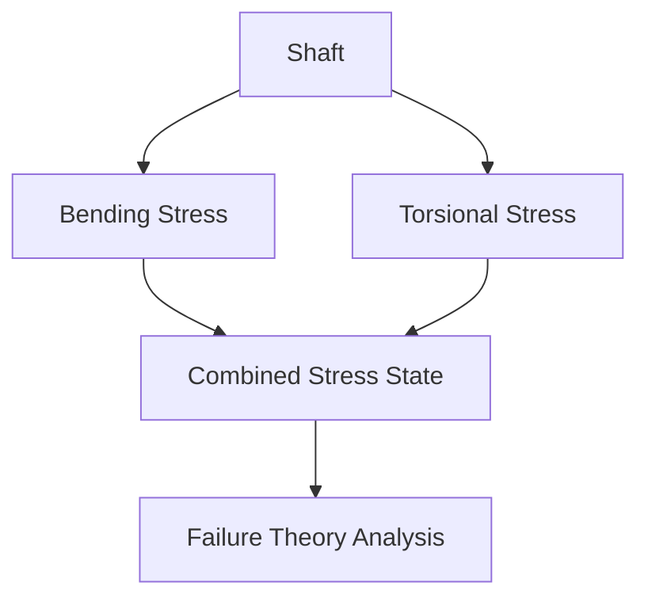
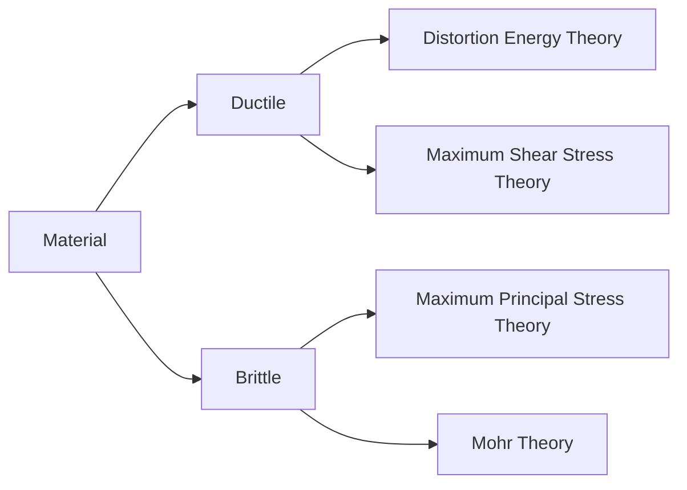
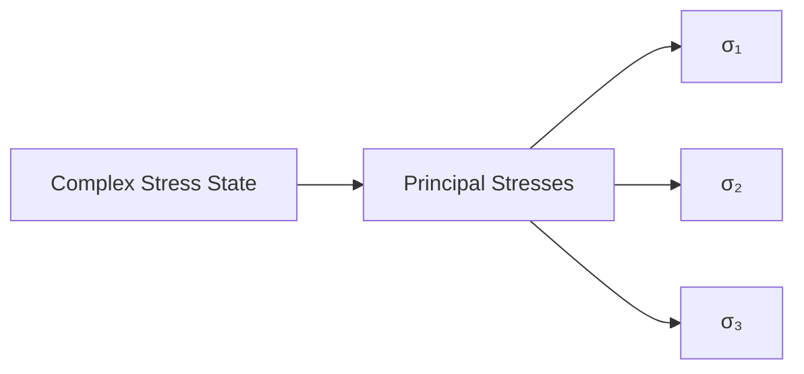
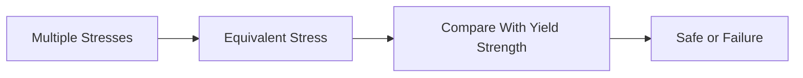
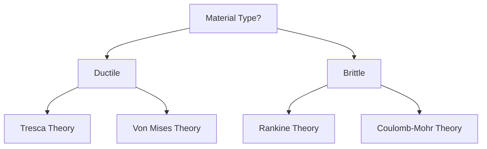

# ⚠ Failure Theories

Machine components are often subjected to multiple stresses at the same time. A
shaft may experience bending and torsion simultaneously, while a pressure vessel
may experience stresses in multiple directions.

Failure theories help engineers predict whether a component will fail under
complex loading conditions and determine safe design limits.

---

## Why Do We Need Failure Theories?

In practical applications:

- Components rarely experience a single stress.
- Multiple stresses act simultaneously.
- Simple tensile test results cannot directly predict failure.

Failure theories provide a method to compare complex stress states with material
strength.

## Example

Consider a transmission shaft.

It experiences:

- Bending Stress
- Torsional Stress

<!-- Visual flow for ⚠ Failure Theories. -->


Without failure theories, safe design would be difficult.

## Classification of Materials

Before studying failure theories, materials are classified into two categories.

## Ductile Materials

Materials that undergo significant plastic deformation before fracture.

Examples:

- Mild Steel
- Aluminum
- Copper

Characteristics:

✅ High toughness

✅ Large deformation before failure

## Brittle Materials

Materials that fracture with little or no plastic deformation.

- Cast Iron
- Glass
- Ceramics

❌ Sudden fracture

❌ Little warning before failure

## Why Different Theories?

Different materials fail differently.

<!-- Visual flow for ⚠ Failure Theories. -->


## Principal Stresses

When a component is loaded, stresses can be transformed into principal stresses.

These are:

- Maximum Principal Stress (σ₁)
- Intermediate Principal Stress (σ₂)
- Minimum Principal Stress (σ₃)

<!-- Visual flow for ⚠ Failure Theories. -->


Most failure theories use principal stresses.

### (Rankine Theory)

This theory states:

Failure occurs when the maximum principal stress reaches the material's ultimate
strength.

## Criterion

Failure occurs if:

// Example demonstrating ⚠ Failure Theories.
```
σ₁ ≥ σ_allowable
```

## Assumptions

- Material fails due to normal stress.
- Shear effects are neglected.

## Suitable For

✅ Brittle Materials

- Cast Iron
- Concrete
- Glass

## Advantages

- Simple
- Easy calculations

## Limitations

- Not suitable for ductile materials.
- Ignores shear stress effects.

### (Guest-Tresca Theory)

One of the most widely used theories for ductile materials.

Failure occurs when maximum shear stress equals the shear stress at yielding.

Maximum shear stress:

:contentReference[oaicite:0]{index=0}

Yielding occurs when:

// Example demonstrating ⚠ Failure Theories.
```
τmax ≥ τyield
```

## Physical Meaning

Yielding begins because of shear deformation inside the material.

✅ Ductile Materials

- Steel shafts
- Bolts
- Machine frames

- Simple
- Conservative design

- Can overestimate failure in some cases.

### (Saint-Venant Theory)

Failure occurs when maximum strain reaches the strain at failure in a tensile
test.

Based on:

- Normal stress
- Poisson's ratio effects

## Applications

Historically important but rarely used today.

- Less accurate than modern theories.

### (Haigh Theory)

According to this theory:

Failure occurs when total strain energy reaches the strain energy at yield.

## Energy Components

Total energy includes:

- Normal stress energy
- Shear stress energy

- Better than maximum strain theory.

- Less accurate than distortion energy theory.

### (Von Mises Theory)

This is the most commonly used failure theory in modern machine design.

It states:

Failure occurs when distortion energy reaches the distortion energy at yielding.

## Von Mises Equivalent Stress

For a two-dimensional stress state:

:contentReference[oaicite:1]{index=1}

## Failure Criterion

// Example demonstrating ⚠ Failure Theories.
```
σv ≥ Yield Strength
```

- Shafts
- Pressure vessels
- Automotive components
- Aircraft structures

- Highly accurate
- Widely accepted
- Used in Finite Element Analysis (FEA)

## Why Engineers Prefer Von Mises Theory

<!-- Visual flow for ⚠ Failure Theories. -->


It converts a complex stress state into a single equivalent stress.

## 6⃣ Coulomb-Mohr Theory

Used mainly for brittle materials.

This theory accounts for:

- Different tensile strengths
- Different compressive strengths

✅ Cast Iron

✅ Ceramics

✅ Concrete

- More realistic for brittle materials.

## Comparison of Failure Theories

| Theory                        | Material Type | Accuracy  | Usage          |
| ----------------------------- | ------------- | --------- | -------------- |
| Maximum Principal Stress      | Brittle       | Moderate  | Common         |
| Maximum Shear Stress (Tresca) | Ductile       | Good      | Machine Design |
| Maximum Strain                | Limited       | Low       | Rare           |
| Total Strain Energy           | Moderate      | Moderate  | Limited        |
| Distortion Energy (Von Mises) | Ductile       | Excellent | Most Popular   |
| Coulomb-Mohr                  | Brittle       | Good      | Brittle Design |

## 📈 Failure Theory Selection Guide

<!-- Visual flow for ⚠ Failure Theories. -->


## Shafts

Loading:

- Bending
- Torsion

Preferred Theory:

✅ Von Mises

✅ Tresca

## Bolts

- Tension
- Shear

## Pressure Vessels

- Multi-axial stress

## Cast Iron Components

- Brittle behavior

✅ Rankine

✅ Coulomb-Mohr

## Automotive Components

- Axles
- Suspension arms
- Steering components

## ⚠ Factors Affecting Failure

Even if theoretical calculations show safety, failure can still occur because
of:

- Fatigue
- Corrosion
- Wear
- Manufacturing defects
- Stress concentration
- Temperature effects

Therefore, engineers use:

- Factor of Safety
- Fatigue analysis
- Experimental testing

along with failure theories.

## Factor of Safety

Safe design requires:

// Example demonstrating ⚠ Failure Theories.
```
Factor of Safety = Failure Strength / Working Stress
```

The chosen failure theory is used to calculate the working stress.

## Key Points

- Failure theories predict component failure under combined stresses.
- Different theories are used for ductile and brittle materials.
- Rankine Theory is commonly used for brittle materials.
- Tresca Theory is based on maximum shear stress.
- Von Mises Theory is based on distortion energy and is the most widely used
  theory for ductile materials.
- Failure theories simplify complex stress states into safe design criteria.
- Modern machine design and FEA software primarily use Von Mises stress.
- Proper failure theory selection is essential for safe and economical machine
  design.

## Quick Reference

| Area | Revision point |
|---|---|
| Definition | State exactly what the topic means. |
| Mechanism | Explain the steps that produce the result. |
| Example | Use a small realistic case. |
| Pitfalls | Know common mistakes and boundary cases. |
