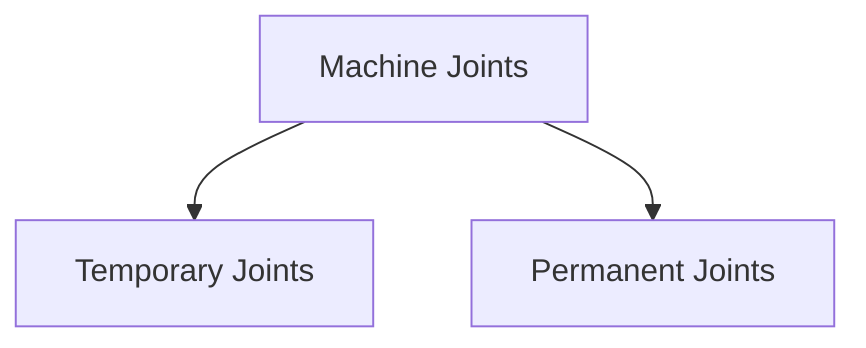
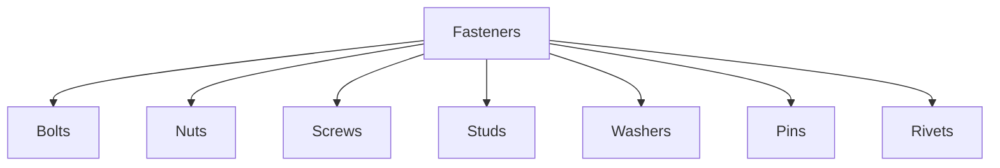
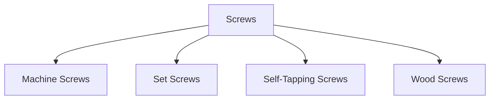
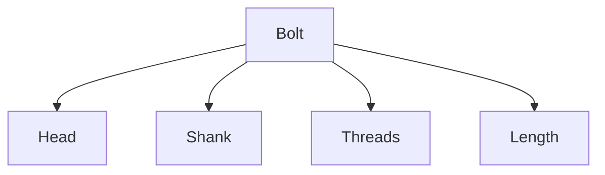
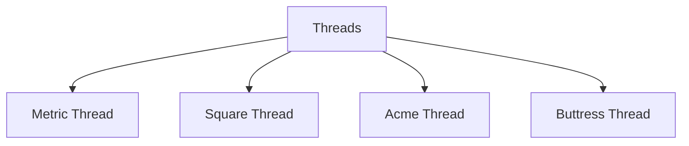
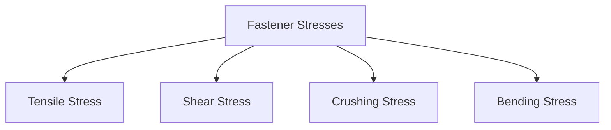
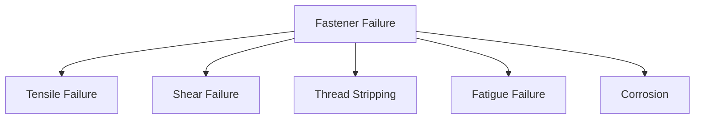
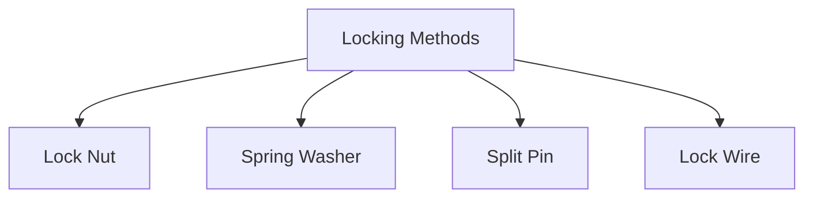

# 🔩 Fasteners

Fasteners are machine elements used to join two or more components together.
They play a critical role in machine design by providing reliable connections
that can either be permanent or temporary.

Almost every machine, structure, automobile, and industrial system uses
fasteners.

Examples:

- Bolts
- Nuts
- Screws
- Studs
- Rivets
- Pins

---

## Functions of Fasteners

Fasteners are used to:

✅ Join machine components

✅ Transmit loads

✅ Maintain alignment

✅ Allow assembly and disassembly

✅ Simplify maintenance and repair

## Why Fasteners are Important

Without fasteners:

- Components would separate during operation.
- Maintenance would become difficult.
- Assembly would be impossible.

## Types of Joints

<!-- Visual flow for 🔩 Fasteners. -->


## Temporary Joints

Can be dismantled without damaging components.

- Bolts
- Nuts
- Screws
- Studs

## Permanent Joints

Cannot be dismantled without destroying the joint.

- Rivets
- Welds

## Classification of Fasteners

<!-- Visual flow for 🔩 Fasteners. -->


## 🔩 Bolts

A bolt is a threaded fastener used with a nut to join components.

<!-- Visual flow for 🔩 Fasteners. -->


## Characteristics

- External threads
- Requires a nut
- Easy assembly and removal

## Applications

- Structural connections
- Machine frames
- Automobile assemblies

## Hexagonal Bolt

Most widely used bolt.

// Example demonstrating 🔩 Fasteners.
```
 ______
| HEX |
|_____|
   ||
   ||
```

## Square Head Bolt

Used in heavy-duty machinery.

## T-Bolt

Used in machine tool tables and slots.

## Eye Bolt

Contains a loop for lifting applications.

## 🔘 Nuts

A nut is internally threaded and used with a bolt.

Function:

- Holds components together.

<!-- Visual flow for 🔩 Fasteners. -->


## Hex Nut

Most commonly used.

## Castle Nut

Contains slots for locking.

Used with split pins.

## Cap Nut

Protects exposed bolt threads.

## Wing Nut

Can be tightened manually.

## 🔧 Screws

A screw is a threaded fastener that usually does not require a nut.

It engages directly with the material.

## Types of Screws

<!-- Visual flow for 🔩 Fasteners. -->


## Machine Screw

Used in machinery and equipment.

## Set Screw

Prevents relative motion between components.

Commonly used in:

- Pulleys
- Gears
- Couplings

## Self-Tapping Screw

Creates its own thread during installation.

## 🧱 Studs

A stud is a threaded rod with threads on both ends.

<!-- Visual flow for 🔩 Fasteners. -->


- Engine cylinders
- Pressure vessels
- Heavy machinery

## ⚪ Washers

Washers are placed under bolt heads or nuts.

Functions:

✅ Distribute load

✅ Prevent surface damage

✅ Reduce loosening

## Plain Washer

Most common washer.

## Spring Washer

Prevents loosening caused by vibration.

## Lock Washer

Provides additional locking action.

## 📍 Pins

Pins are used for positioning and locking components.

## Dowel Pin

Used for accurate positioning.

## Taper Pin

Provides tight fitting.

## Split Pin

Used with castle nuts.

<!-- Visual flow for 🔩 Fasteners. -->


## 🔗 Rivets

A rivet is a permanent fastening element.

After installation, it cannot be removed without destruction.

<!-- Visual flow for 🔩 Fasteners. -->


- Aircraft structures
- Bridges
- Boilers

## 📏 Bolt Terminology

<!-- Visual flow for 🔩 Fasteners. -->


## Head

Used for tightening.

## Shank

Unthreaded portion.

## Threads

Provide gripping action.

## Major Diameter

Largest thread diameter.

## Minor Diameter

Smallest thread diameter.

## Pitch

Distance between adjacent threads.

## Lead

Distance advanced in one complete revolution.

## Types of Threads

<!-- Visual flow for 🔩 Fasteners. -->


## Metric Thread

Most widely used standard thread.

## Square Thread

High efficiency.

Used in:

- Screw jacks
- Presses

## Acme Thread

Stronger and easier to manufacture.

## Buttress Thread

Suitable for heavy loads in one direction.

## Stresses in Fasteners

Fasteners are subjected to various stresses.

<!-- Visual flow for 🔩 Fasteners. -->


## Tensile Stress

Occurs due to axial loading.

Common in bolts.

## Shear Stress

Occurs when components attempt to slide.

Common in rivets and pins.

## Crushing Stress

Occurs between mating surfaces.

## Bending Stress

Occurs under eccentric loading.

## Failure of Fasteners

<!-- Visual flow for 🔩 Fasteners. -->


## Tensile Failure

Bolt breaks due to excessive tension.

## Shear Failure

Occurs due to transverse loading.

## Thread Stripping

Threads become damaged under overload.

## Fatigue Failure

Caused by repeated loading cycles.

## Corrosion Failure

Occurs in harsh environments.

## Methods to Prevent Loosening

Vibration can loosen fasteners.

Common locking methods:

<!-- Visual flow for 🔩 Fasteners. -->


## Design Considerations

When selecting a fastener:

- Load capacity
- Material strength
- Corrosion resistance
- Temperature
- Ease of maintenance
- Cost

## Materials Used for Fasteners

| Material        | Application                |
| --------------- | -------------------------- |
| Mild Steel      | General purpose            |
| Carbon Steel    | Machine assemblies         |
| Alloy Steel     | High-strength applications |
| Stainless Steel | Corrosion resistance       |
| Brass           | Electrical fittings        |

## Automotive Industry

- Engine assembly
- Suspension systems

## Aerospace Industry

- Aircraft structures

## Industrial Machinery

- Machine frames
- Gearboxes

## Construction

- Steel structures
- Bridges

## Household Products

- Furniture
- Appliances

## 📈 Advantages of Fasteners

✅ Easy assembly

✅ Easy maintenance

✅ Low manufacturing cost

✅ Standardized components

✅ Replaceable parts

## ⚠ Limitations

❌ Can loosen due to vibration

❌ Subject to corrosion

❌ Stress concentration around holes

❌ Fatigue failure possible

## Key Points

- Fasteners are used to join machine components.
- Fasteners can be temporary or permanent.
- Bolts, nuts, screws, studs, and washers are common fasteners.
- Rivets create permanent joints.
- Fasteners experience tensile, shear, and crushing stresses.
- Proper locking methods prevent loosening.
- Material selection significantly affects fastener performance.
- Fasteners are essential in mechanical, automotive, aerospace, and construction
  industries.

## Quick Reference

| Area | Revision point |
|---|---|
| Definition | State exactly what the topic means. |
| Mechanism | Explain the steps that produce the result. |
| Example | Use a small realistic case. |
| Pitfalls | Know common mistakes and boundary cases. |
