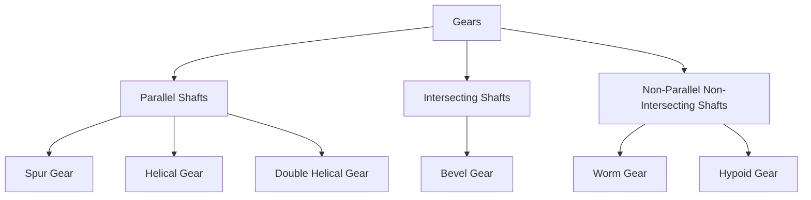
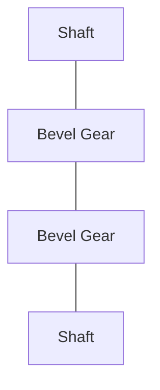
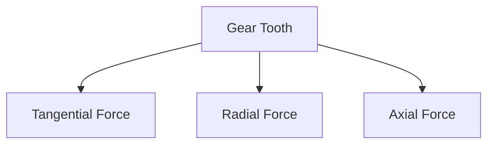
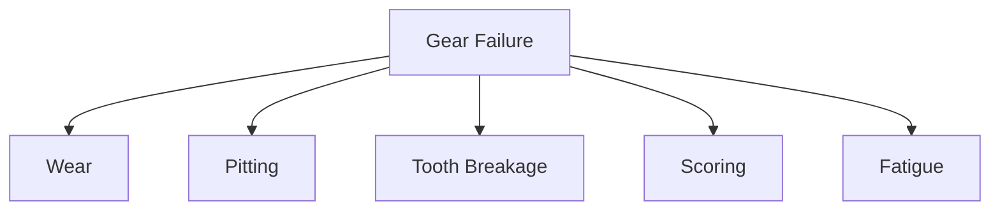

# ⚙ Gears

Gears are machine elements used to transmit power and motion between rotating
shafts. They provide a positive drive, meaning there is no slip between the
driving and driven members.

Gears are widely used in automobiles, industrial machinery, clocks, turbines,
conveyors, and robotics.

---

## Functions of Gears

Gears are used to:

✅ Transmit power

✅ Change rotational speed

✅ Change torque

✅ Change direction of rotation

✅ Transfer motion between shafts

## 🚗 Real-Life Examples

- Car gearbox
- Bicycle gear system
- Industrial reducers
- Wind turbines
- Lathe machines
- Robotic arms

## ⚙ Basic Terminology

<!-- Visual flow for ⚙ Gears. -->


### Driver Gear

The gear that supplies power.

### Driven Gear

The gear that receives power.

## 📏 Gear Ratio

Gear ratio determines speed and torque relationship.

// Example demonstrating ⚙ Gears.
```
Gear Ratio = Number of Teeth on Driven Gear / Number of Teeth on Driver Gear
```

Example:

Driver Gear = 20 teeth

Driven Gear = 40 teeth

// Example demonstrating ⚙ Gears.
```
Gear Ratio = 40 / 20 = 2
```

Result:

- Speed reduces by half
- Torque doubles

## Principle of Gear Operation

When teeth of two gears mesh:

- Driver rotates
- Teeth push driven gear
- Motion is transferred

<!-- Visual flow for ⚙ Gears. -->


## 📚 Classification of Gears

<!-- Visual flow for ⚙ Gears. -->


## 1⃣ Spur Gears

The simplest and most commonly used gears.

Characteristics:

- Straight teeth
- Parallel shafts
- Easy manufacturing

<!-- Visual flow for ⚙ Gears. -->


### Advantages

✅ Simple design

✅ Low cost

✅ High efficiency

### Disadvantages

❌ Noisy at high speed

## Applications

- Gear pumps
- Machine tools
- Speed reducers

## 2⃣ Helical Gears

Teeth are cut at an angle.

<!-- Visual flow for ⚙ Gears. -->


- Smooth operation
- Quiet running
- Higher load capacity


✅ Less vibration

✅ Higher strength

✅ Suitable for high speeds


❌ Generates axial thrust

❌ More expensive

- Automobile gearboxes
- Compressors
- Turbines

## 3⃣ Double Helical Gears

Consist of two opposite helical gears.

<!-- Visual flow for ⚙ Gears. -->


Benefits:

- Axial thrust cancellation
- Smooth power transmission

- Heavy machinery
- Marine drives

## 4⃣ Bevel Gears

Used when shafts intersect.

Usually at 90°.

<!-- Visual flow for ⚙ Gears. -->


✅ Change direction of motion

✅ Compact design

- Differential systems
- Power tools

## 5⃣ Worm Gears

Used between non-parallel shafts.

Consists of:

- Worm
- Worm Wheel

<!-- Visual flow for ⚙ Gears. -->


✅ Very high reduction ratio

✅ Smooth operation

✅ Self-locking capability

❌ Lower efficiency

❌ Heat generation

- Elevators
- Conveyors
- Hoists

## Pitch Circle

Imaginary circle where gear teeth engage.

## Pitch Diameter

Diameter of the pitch circle.

## Module

Size of gear teeth.

// Example demonstrating ⚙ Gears.
```
Module = Pitch Diameter / Number of Teeth
```

Unit: mm

## Circular Pitch

Distance between corresponding points on adjacent teeth.

## Pressure Angle

Angle between line of action and tangent to pitch circle.

Common values:

- 20°
- 14.5°

## Addendum

Distance from pitch circle to tooth tip.

## Dedendum

Distance from pitch circle to tooth root.

## Gear Forces

When gears mesh, forces act on teeth.

<!-- Visual flow for ⚙ Gears. -->


## Tangential Force

Responsible for power transmission.

## Radial Force

Acts toward gear center.

## Axial Force

Present mainly in helical gears.

## 🔩 Gear Materials

Selection depends on:

- Load
- Speed
- Cost
- Wear resistance

| Material    | Application    |
| ----------- | -------------- |
| Cast Iron   | Light duty     |
| Mild Steel  | General use    |
| Alloy Steel | Heavy duty     |
| Bronze      | Worm gears     |
| Plastic     | Low load gears |

## ⚠ Gear Failures

Common gear failures include:

<!-- Visual flow for ⚙ Gears. -->


## 1. Wear

Gradual removal of tooth material.

Causes:

- Poor lubrication
- Dust particles

## 2. Pitting

Small surface cavities caused by contact fatigue.

## 3. Tooth Breakage

Occurs due to overload.

## 4. Scoring

Surface damage caused by excessive friction.

## 5. Fatigue Failure

Repeated stress causes crack formation.

## 🛢 Gear Lubrication

Lubrication is essential to:

- Reduce wear
- Reduce friction
- Dissipate heat
- Increase service life

Methods:

- Oil bath lubrication
- Splash lubrication
- Forced lubrication

## Automotive

- Gearboxes
- Differentials

## Manufacturing

- Machine tools
- Conveyors

## Power Plants

- Turbines
- Generators

## Robotics

- Motion control systems

## Aerospace

- Transmission systems

## 📈 Advantages of Gears

✅ Positive transmission

✅ Compact size

✅ Accurate speed ratio

✅ Long service life

## ⚠ Limitations

❌ Expensive manufacturing

❌ Precise alignment required

❌ Lubrication needed

❌ Can become noisy at high speed

## Key Points

- Gears transmit power and motion without slip.
- Spur gears are used for parallel shafts.
- Helical gears provide smoother operation.
- Bevel gears connect intersecting shafts.
- Worm gears provide large speed reductions.
- Gear ratio determines speed and torque relationships.
- Proper lubrication greatly increases gear life.
- Common failures include wear, pitting, and tooth breakage.
- Gears are essential components in almost every mechanical system.

## Quick Reference

| Area | Revision point |
|---|---|
| Definition | State exactly what the topic means. |
| Mechanism | Explain the steps that produce the result. |
| Example | Use a small realistic case. |
| Pitfalls | Know common mistakes and boundary cases. |
