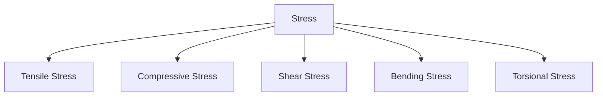
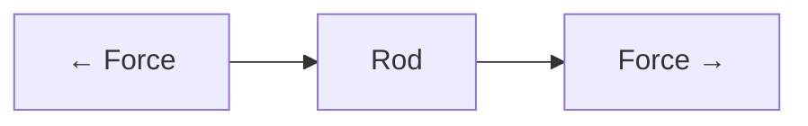
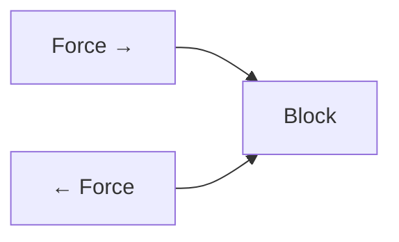
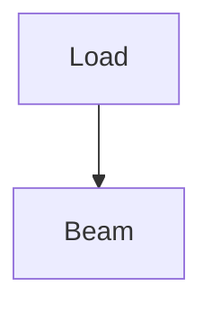
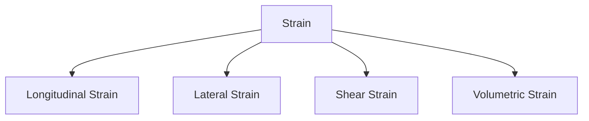

# Stress & Strain

Stress and Strain are the fundamental concepts of Machine Design. Every machine
component such as shafts, gears, bolts, springs, and beams experiences forces
during operation.

To design safe and reliable components, engineers must understand how materials
behave under these forces.

---

## Why Study Stress and Strain?

Machine components are subjected to:

- Pulling forces
- Pushing forces
- Twisting forces
- Bending forces

If these forces exceed the material's capacity, failure occurs.

Understanding stress and strain helps engineers:

✅ Design safe components

✅ Select suitable materials

✅ Predict failures

✅ Improve reliability

## What is Stress?

Stress is the internal resisting force developed within a material when an
external force acts on it.

It represents how much force is acting per unit area.

## Mathematical Expression

:contentReference[oaicite:0]{index=0}

Where:

- σ = Stress (N/m² or Pa)
- F = Applied Force (N)
- A = Cross-sectional Area (m²)

## Simple Example

Imagine pulling a rope.

The rope develops internal resistance against the pulling force.

That internal resistance per unit area is called stress.

## 📏 What is Strain?

Strain is the deformation produced in a material due to applied stress.

It indicates how much a material changes in shape or size.

// Example demonstrating Stress & Strain.
```
Strain = Change in Length / Original Length
```

Or

:contentReference[oaicite:1]{index=1}

- ε = Strain
- ΔL = Change in Length
- L = Original Length

## Difference Between Stress and Strain

| Stress                    | Strain                          |
| ------------------------- | ------------------------------- |
| Internal resistance       | Deformation                     |
| Measured in Pa            | Dimensionless                   |
| Caused by force           | Caused by stress                |
| Represents load intensity | Represents material deformation |

## ⚙ Types of Stress

<!-- Visual flow for Stress & Strain. -->


## 1⃣ Tensile Stress

Occurs when a component is stretched.

Examples:

- Crane cables
- Suspension bridge wires
- Lifting chains

<!-- Visual flow for Stress & Strain. -->


The rod elongates under the applied load.

## 2⃣ Compressive Stress

Occurs when a component is compressed.

- Building columns
- Hydraulic press members
- Machine supports

<!-- Visual flow for Stress & Strain. -->


The component shortens due to compression.

## 3⃣ Shear Stress

Occurs when forces act parallel to the surface.

- Rivets
- Bolts
- Pins

## Formula

:contentReference[oaicite:2]{index=2}

- τ = Shear Stress

## Example

A bolt joining two plates experiences shear stress when the plates try to slide.

## 4⃣ Bending Stress

Occurs when a member bends due to transverse loads.

- Beams
- Shafts
- Crane arms

<!-- Visual flow for Stress & Strain. -->


Upper fibers compress while lower fibers stretch.

## 5⃣ Torsional Stress

Occurs when torque twists a component.

- Transmission shafts
- Screwdrivers
- Motor shafts

<!-- Visual flow for Stress & Strain. -->


## Types of Strain

<!-- Visual flow for Stress & Strain. -->


## 1⃣ Longitudinal Strain

Change in length divided by original length.

Occurs during tension or compression.

## 2⃣ Lateral Strain

Change in dimensions perpendicular to applied force.

Example:

When a rod stretches, its diameter decreases.

## 3⃣ Shear Strain

Angular deformation caused by shear stress.

Common in rivets and bolts.

## 4⃣ Volumetric Strain

Change in volume divided by original volume.

Observed in pressure vessels and hydraulic systems.

## 📈 Stress-Strain Curve

The Stress-Strain Curve shows how materials behave under loading.

<!-- Visual flow for Stress & Strain. -->


## Elastic Region

- Material returns to original shape after load removal.
- Obeys Hooke's Law.

## Yield Point

- Permanent deformation begins.
- Material no longer fully recovers.

## Plastic Region

- Large deformation occurs.
- Permanent changes remain.

## Ultimate Stress

Maximum stress the material can withstand.

## Fracture Point

Final failure of the material.

## 🔗 Hooke's Law

Within the elastic limit:

:contentReference[oaicite:3]{index=3}

- E = Young's Modulus

This means:

Stress is directly proportional to strain.

## 📐 Young's Modulus

Young's Modulus measures material stiffness.

// Example demonstrating Stress & Strain.
```
Young's Modulus = Stress / Strain
```

Higher value ⇒ Stiffer material

| Material | Young's Modulus |
| -------- | --------------- |
| Rubber   | Very Low        |
| Aluminum | Moderate        |
| Steel    | High            |

## ⚠ Working Stress

Machine components should not operate at ultimate stress.

Safe design uses:

// Example demonstrating Stress & Strain.
```
Working Stress = Ultimate Stress / Factor of Safety
```

## Factor of Safety (FOS)

Factor of Safety accounts for uncertainties.

// Example demonstrating Stress & Strain.
```
FOS = Failure Stress / Working Stress
```

Typical values:

| Component          | FOS |
| ------------------ | --- |
| Machine Parts      | 2–4 |
| Pressure Vessels   | 3–6 |
| Structural Members | 4–8 |

## Shafts

- Torsional stress
- Bending stress

## Gears

- Contact stress
- Bending stress

## Bolts

- Tensile stress
- Shear stress

## Springs

- Shear stress
- Fatigue stress

## Pressure Vessels

- Hoop stress
- Longitudinal stress

## 🚨 Failure Due to Excess Stress

Common failures include:

- Yielding
- Fracture
- Buckling
- Fatigue
- Wear

Engineers design components to avoid these failures.

## Key Points

- Stress is force per unit area.
- Strain is deformation per unit length.
- Stress causes strain.
- Tensile, compressive, shear, bending, and torsional stresses are common in
  machine elements.
- Hooke's Law applies within the elastic region.
- Young's Modulus indicates material stiffness.
- Factor of Safety ensures safe operation.
- Understanding stress and strain is essential for machine design.

## Quick Reference

| Area | Revision point |
|---|---|
| Definition | State exactly what the topic means. |
| Mechanism | Explain the steps that produce the result. |
| Example | Use a small realistic case. |
| Pitfalls | Know common mistakes and boundary cases. |
