# 🔗 Welded & Riveted Joints

Welded and riveted joints are permanent fastening methods used to connect two or
more machine components. They are extensively used in machine structures,
pressure vessels, bridges, ships, aircraft, and industrial equipment.

These joints are designed to safely transfer loads while maintaining structural
integrity.

---

## Why Permanent Joints are Needed

In many engineering applications:

- High strength is required
- Frequent disassembly is not needed
- Leak-proof connections are desired

Permanent joints provide:

✅ High strength

✅ Reliability

✅ Rigidity

✅ Long service life

## Classification of Permanent Joints

<!-- Visual flow for 🔗 Welded & Riveted Joints. -->
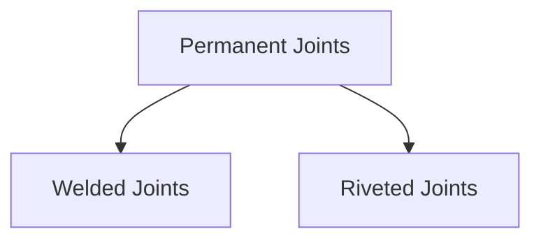

## 🧱 Riveted Joints

A riveted joint is a permanent joint created using rivets.

A rivet is a cylindrical metal pin having a head on one side. After insertion
into holes, the other end is deformed to form a second head.

<!-- Visual flow for 🔗 Welded & Riveted Joints. -->


## Components of a Rivet

<!-- Visual flow for 🔗 Welded & Riveted Joints. -->
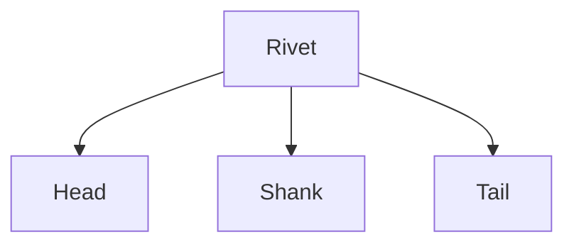

## Working of a Riveted Joint

1. Holes are drilled in plates.
2. Rivet is inserted.
3. Tail end is hammered or pressed.
4. Permanent joint is formed.

<!-- Visual flow for 🔗 Welded & Riveted Joints. -->


## Types of Riveted Joints

<!-- Visual flow for 🔗 Welded & Riveted Joints. -->
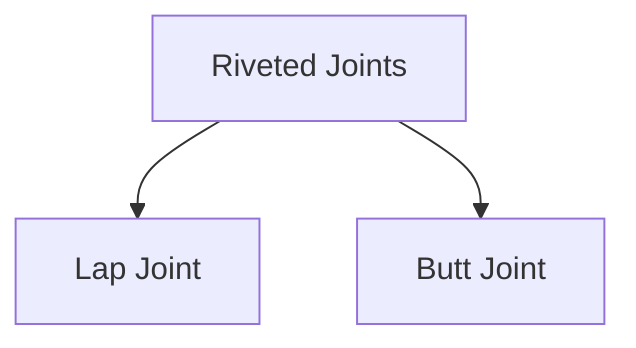

## 1⃣ Lap Joint

Plates overlap each other.

<!-- Visual flow for 🔗 Welded & Riveted Joints. -->


## Advantages

✅ Simple construction

✅ Easy manufacturing

## Applications

- Structural connections
- Light fabrication work

## 2⃣ Butt Joint

Plates are placed edge-to-edge.

A cover plate is used.

<!-- Visual flow for 🔗 Welded & Riveted Joints. -->


✅ Better alignment

✅ Stronger construction

## Classification Based on Rivet Arrangement

<!-- Visual flow for 🔗 Welded & Riveted Joints. -->
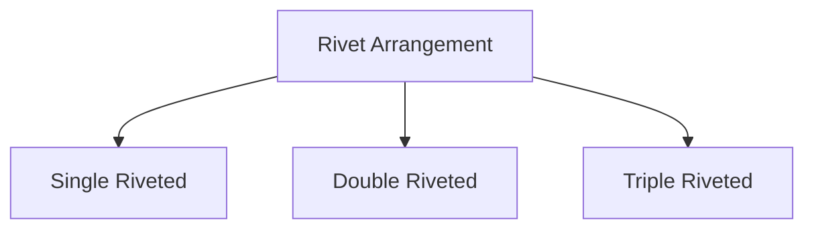

## Single Riveted Joint

One row of rivets.

## Double Riveted Joint

Two rows of rivets.

Provides higher strength.

## Triple Riveted Joint

Three rows of rivets.

Used in heavy-duty applications.

## Rivet Terminology

<!-- Visual flow for 🔗 Welded & Riveted Joints. -->
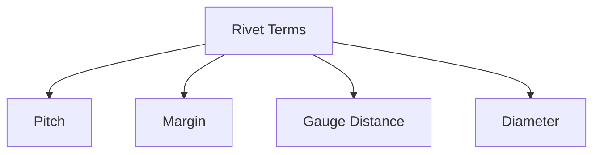

## Pitch

Distance between centers of adjacent rivets.

## Margin

Distance from rivet center to plate edge.

## Gauge Distance

Distance between rivet rows.

## Diameter

Diameter of rivet shank.

## Stresses in Riveted Joints

<!-- Visual flow for 🔗 Welded & Riveted Joints. -->
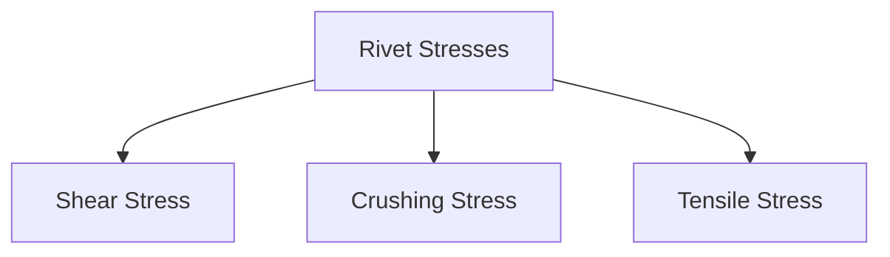

## Shear Failure

Rivet may shear under transverse loads.

<!-- Visual flow for 🔗 Welded & Riveted Joints. -->


## Crushing Failure

Occurs due to excessive bearing pressure between rivet and plate.

## Tearing Failure

Plate tears between rivet holes.

## Advantages of Riveted Joints

✅ Reliable

✅ Strong

✅ Good fatigue resistance

✅ Suitable for dynamic loading

## Limitations of Riveted Joints

❌ Additional weight

❌ Requires hole drilling

❌ Stress concentration around holes

❌ Labour intensive

## Applications of Riveted Joints

- Aircraft structures
- Bridges
- Boilers
- Pressure vessels
- Shipbuilding

## Welded Joints

Welding is a process of joining materials by fusion with or without filler
material.

A welded joint is formed when metal parts are heated and fused together.

<!-- Visual flow for 🔗 Welded & Riveted Joints. -->


## Advantages of Welding

✅ High joint efficiency

✅ Lightweight structure

✅ Leak-proof connection

✅ Attractive appearance

✅ No holes required

## Why Welding is Popular

Compared with riveted joints:

- Less material required
- Lower weight
- Higher strength
- Better appearance

## Types of Welded Joints

<!-- Visual flow for 🔗 Welded & Riveted Joints. -->
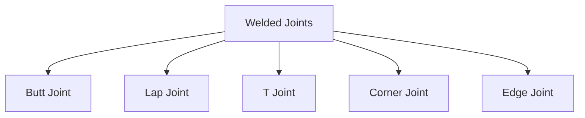

## 1⃣ Butt Weld Joint

Two plates are joined edge-to-edge.

<!-- Visual flow for 🔗 Welded & Riveted Joints. -->


Applications:

- Pressure vessels
- Pipelines

## 2⃣ Lap Weld Joint

One plate overlaps another.

<!-- Visual flow for 🔗 Welded & Riveted Joints. -->


## 3⃣ T-Joint

Two members form a T shape.

<!-- Visual flow for 🔗 Welded & Riveted Joints. -->
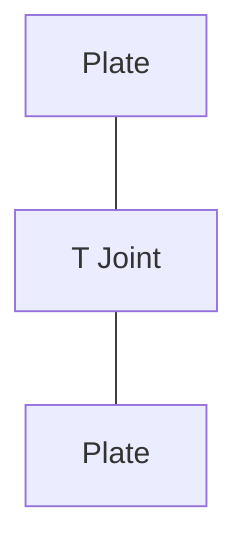

## 4⃣ Corner Joint

Used at right-angle corners.

Common in frames and boxes.

## 5⃣ Edge Joint

Edges of plates are welded together.

Used for light-duty applications.

## Types of Welds

<!-- Visual flow for 🔗 Welded & Riveted Joints. -->
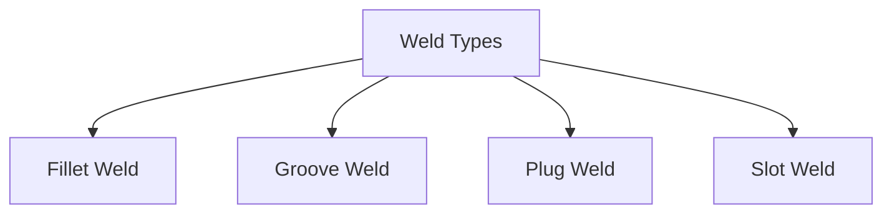

## Fillet Weld

Most common weld type.

Used in:

- Lap joints
- T-joints

<!-- Visual flow for 🔗 Welded & Riveted Joints. -->
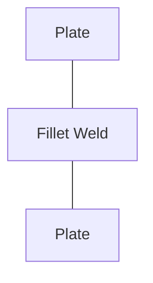

## Groove Weld

Used in butt joints.

Provides high strength.

## Plug Weld

Weld deposited in circular holes.

## Slot Weld

Weld deposited in elongated slots.

## Stresses in Welded Joints

<!-- Visual flow for 🔗 Welded & Riveted Joints. -->
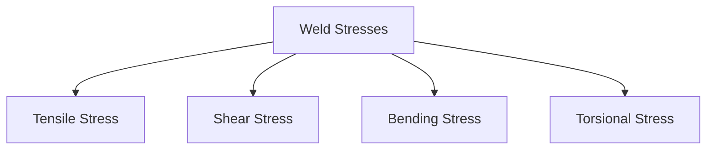

## Tensile Stress

Occurs due to pulling loads.

## Shear Stress

Most common stress in fillet welds.

## Bending Stress

Occurs due to eccentric loading.

## Torsional Stress

Occurs when torque acts on welded structures.

## Weld Defects

Improper welding may cause defects.

<!-- Visual flow for 🔗 Welded & Riveted Joints. -->
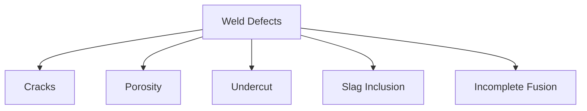

## Cracks

Most dangerous weld defect.

May lead to sudden failure.

## Porosity

Gas pockets trapped inside weld metal.

## Undercut

Groove formed near weld edge.

Reduces strength.

## Slag Inclusion

Non-metallic particles trapped inside weld.

## Incomplete Fusion

Poor bonding between weld and base metal.

## Comparison: Welded vs Riveted Joints

| Feature              | Welded Joint | Riveted Joint |
| -------------------- | ------------ | ------------- |
| Weight               | Lower        | Higher        |
| Strength             | Higher       | Lower         |
| Leak Proof           | Yes          | No            |
| Appearance           | Better       | Moderate      |
| Manufacturing Cost   | Lower        | Higher        |
| Maintenance          | Low          | Moderate      |
| Stress Concentration | Low          | High          |

## Design Considerations

Engineers consider:

- Applied load
- Material properties
- Joint efficiency
- Safety factor
- Fatigue loading
- Manufacturing method

## Joint Efficiency

Joint efficiency indicates how strong the joint is compared to the original
plate.

```
Joint Efficiency = Strength of Joint / Strength of Solid Plate × 100%
```

Higher efficiency means a stronger joint.

- Pipelines
- Pressure vessels
- Structural frames
- Automobiles
- Industrial machinery

## Riveted Joints

- Aircraft structures
- Bridges
- Boilers
- Ship construction

## 📈 Advantages of Permanent Joints

✅ Reliable operation

✅ Suitable for heavy loads

## ⚠ Limitations

❌ Difficult to dismantle

❌ Repairs may be costly

❌ Inspection may be required

❌ Manufacturing defects can reduce strength

## Key Points

- Welded and riveted joints are permanent joints.
- Riveted joints use rivets to connect components.
- Welded joints use fusion of materials.
- Common riveted joints are lap and butt joints.
- Common welded joints are butt, lap, T, corner, and edge joints.
- Welded joints are generally lighter and stronger than riveted joints.
- Riveted joints offer excellent fatigue resistance.
- Joint design must consider stresses, efficiency, and safety.
- Welded and riveted joints are widely used in structural and machine design
  applications.

## Quick Reference

| Area | Revision point |
|---|---|
| Definition | State exactly what the topic means. |
| Mechanism | Explain the steps that produce the result. |
| Example | Use a small realistic case. |
| Pitfalls | Know common mistakes and boundary cases. |
