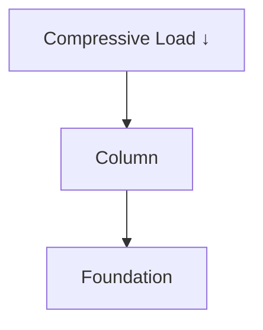
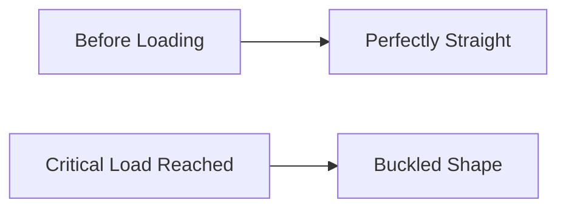

# 📐 Columns & Buckling

A column is a structural member primarily subjected to compressive loads along
its longitudinal axis.

Columns are among the most important load-carrying elements in civil,
mechanical, and structural engineering.

Examples include:

- Building pillars
- Bridge supports
- Transmission towers
- Machine frames
- Steel structures

---

## Why Study Columns?

Engineers analyze columns to:

- Prevent structural collapse
- Determine safe load capacity
- Design economical structures
- Avoid buckling failure
- Ensure long-term stability

## What is a Column?

A column is a compression member whose length is considerably greater than its
cross-sectional dimensions.

<!-- Visual flow for 📐 Columns & Buckling. -->


The load acts along the centroidal axis of the member.

## 📚 Compression Members

Compression members are generally classified as:

## Short Columns

- Small length
- Fail due to crushing
- Buckling is negligible

## Long Columns

- Large length
- Fail due to buckling
- Crushing stress is usually not reached

## Intermediate Columns

- Behavior lies between short and long columns
- Both crushing and buckling influence failure

## What is Buckling?

Buckling is the sudden lateral deflection of a compression member when the
compressive load reaches a critical value.

Instead of crushing directly, the member bends sideways and becomes unstable.

<!-- Visual flow for 📐 Columns & Buckling. -->


## Understanding Buckling

Imagine pressing both ends of a thin ruler.

Initially:

// Example demonstrating 📐 Columns & Buckling.
```
Straight Shape
```

As load increases:

// Example demonstrating 📐 Columns & Buckling.
```
Sudden Sideways Bending
```

This phenomenon is called buckling.

## 🚨 Why Buckling is Dangerous?

Buckling:

- Occurs suddenly
- Produces large deflections
- Can cause structural collapse
- Often happens before material failure

Many structural failures occur due to buckling rather than crushing.

## 📏 Effective Length of a Column

The buckling behavior depends heavily on end conditions.

The equivalent length used in buckling calculations is called the effective
length.

Represented by:

// Example demonstrating 📐 Columns & Buckling.
```
Le
```

## 1⃣ Both Ends Hinged

Most common theoretical case.

<!-- Visual flow for 📐 Columns & Buckling. -->
```mermaid
graph TD
A[Hinge]
B[Column]
C[Hinge]

Effective Length:

```
Le = L
// Example demonstrating 📐 Columns & Buckling.
```

## 2⃣ One End Fixed, One End Free

Known as a cantilever column.

```mermaid
graph TD
A[Fixed End]
B[Column]
C[Free End]

// Example demonstrating 📐 Columns & Buckling.
```
Le = 2L
```

Least stable condition.

## 3⃣ One End Fixed, One End Hinged

<!-- Visual flow for 📐 Columns & Buckling. -->

Le = L/√2
// Example demonstrating 📐 Columns & Buckling.
```

## 4⃣ Both Ends Fixed

Most stable condition.

```mermaid
graph TD
A[Fixed]
B[Column]
C[Fixed]

// Example demonstrating 📐 Columns & Buckling.
```
Le = L/2
```

## Slenderness Ratio

A very important parameter in column design.

Formula:

// Example demonstrating 📐 Columns & Buckling.
```
λ = Le/k
```

Where:

- λ = Slenderness Ratio
- Le = Effective Length
- k = Radius of Gyration

## Radius of Gyration

Radius of gyration indicates how material is distributed about an axis.

// Example demonstrating 📐 Columns & Buckling.
```
k = √(I/A)
```

- I = Moment of Inertia
- A = Cross-sectional Area

## Euler's Theory of Buckling

Leonhard Euler developed the classical theory for long columns.

The theory predicts the load at which a column begins to buckle.

## Euler's Critical Load Formula

// Example demonstrating 📐 Columns & Buckling.
```
Pcr = π²EI / Le²
```

- Pcr = Critical Buckling Load
- E = Young's Modulus
- I = Moment of Inertia
- Le = Effective Length

## Meaning of Critical Load

Critical load is the maximum compressive load a column can carry without
buckling.

If:

// Example demonstrating 📐 Columns & Buckling.
```
Applied Load < Critical Load
```

Column remains stable.

// Example demonstrating 📐 Columns & Buckling.
```
Applied Load > Critical Load
```

Buckling occurs.

## Young's Modulus (E)

Higher stiffness increases buckling resistance.

## Moment of Inertia (I)

Larger sections resist buckling better.

## Effective Length (Le)

Longer columns buckle more easily.

Since:

// Example demonstrating 📐 Columns & Buckling.
```
Pcr ∝ 1/Le²
```

Even a small increase in length greatly reduces strength.

## Example

Suppose:

- Column length doubles

Using Euler's formula:

If length becomes:

// Example demonstrating 📐 Columns & Buckling.
```
2Le
```

Then:

// Example demonstrating 📐 Columns & Buckling.
```
Pcr = π²EI / (2Le)²
```

// Example demonstrating 📐 Columns & Buckling.
```
Pcr = π²EI / 4Le²
```

Critical load becomes one-fourth.

This shows why long columns are vulnerable to buckling.

## Crushing vs Buckling Failure

| Crushing Failure        | Buckling Failure         |
| ----------------------- | ------------------------ |
| Common in short columns | Common in long columns   |
| Material failure occurs | Stability failure occurs |
| Direct compression      | Lateral bending          |
| Gradual failure         | Sudden failure           |

## Methods to Increase Buckling Strength

Engineers improve column stability by:

- Increasing cross-sectional area
- Increasing moment of inertia
- Reducing effective length
- Using bracing systems
- Selecting stiffer materials

## Building Columns

Support floors and roofs.

## Transmission Towers

Resist wind and compressive forces.

## Bridge Piers

Carry loads from bridge decks.

## Crane Structures

Experience significant compression.

## Machine Frames

Provide structural support.

## Important Formulas

Radius of Gyration:

Slenderness Ratio:

Euler Critical Load:

## 🎓 Summary

Columns are structural members designed to carry compressive loads.

Long columns often fail by buckling rather than crushing.

Key concepts:

- Effective Length
- Slenderness Ratio
- Radius of Gyration
- Euler Critical Load

Buckling is a stability problem and must always be considered while designing
columns to ensure safe and reliable structures.

## Quick Reference

| Area | Revision point |
|---|---|
| Definition | State exactly what the topic means. |
| Mechanism | Explain the steps that produce the result. |
| Example | Use a small realistic case. |
| Pitfalls | Know common mistakes and boundary cases. |
