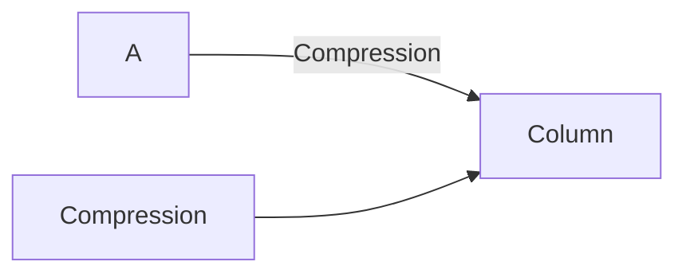
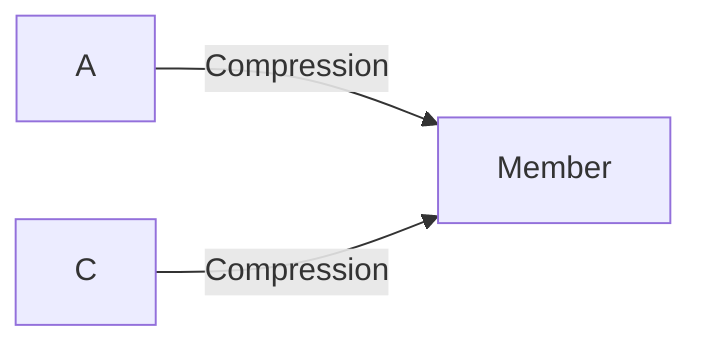
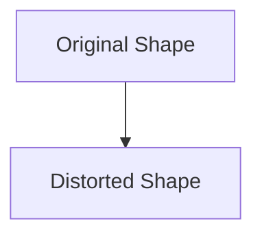

# Stress & Strain Basics

Stress and Strain are the two most important concepts in Solid Mechanics.

Whenever a force acts on a body, internal resisting forces develop inside the
material. These internal forces create stress, while the resulting deformation
produces strain.

Understanding stress and strain helps engineers design safe structures and
machine components.

---

## Why Study Stress and Strain?

Engineers use stress and strain to:

- Design strong structures
- Prevent material failure
- Calculate deformation
- Select suitable materials
- Ensure safety and reliability

Examples:

- Bridge cables under tension
- Building columns under compression
- Shafts under torsion
- Bolts under shear

## What is Stress?

Stress is the internal resisting force per unit area developed inside a material
when an external load is applied.

Mathematically,

```
Stress = Force / Area
```

Unit:

```
Pascal (Pa) = N/m²
```

In engineering practice:

```
MPa = N/mm²
```

## 🧮 Stress Formula

```
σ = P/A
```

Where:

- σ = Stress
- P = Applied Load
- A = Cross-sectional Area

## Example

A steel rod of area 500 mm² carries a load of 50,000 N.

```
σ = 50000 / 500
```

```
σ = 100 N/mm²
```

Therefore,

```
Stress = 100 MPa
```

## 1⃣ Tensile Stress

Produced when a member is pulled.

<!-- Visual flow for Stress & Strain Basics. -->
```mermaid
graph LR
A ← Pulling Force
B[Rod]
C Pulling Force →
```

The rod elongates.

Formula:

```
σt = P/A
```

- Bridge cables
- Crane ropes
- Suspension wires

## 2⃣ Compressive Stress

Produced when a member is pushed.

<!-- Visual flow for Stress & Strain Basics. -->


The member shortens.

```
σc = P/A
```

- Building columns
- Concrete pillars
- Machine supports

## 3⃣ Shear Stress

Occurs when forces act parallel to a surface.

<!-- Visual flow for Stress & Strain Basics. -->


```
τ = P/A
```

- τ = Shear Stress

- Rivets
- Bolts
- Pins
- Punching operations

## What is Strain?

Strain is the deformation produced per unit original dimension.

It indicates how much a material deforms under load.

```
Strain = Change in Dimension / Original Dimension
```

Since both quantities have the same unit:

```
Strain has no unit
```

It is dimensionless.

## 📏 Longitudinal Strain

Produced due to tensile or compressive loading.

```
ε = ΔL/L
```

- ε = Strain
- ΔL = Change in length
- L = Original length

A rod of length 1000 mm elongates by 2 mm.

```
ε = 2/1000
```

```
ε = 0.002
```

```
Strain = 0.002
```

## Tensile Strain

Produced by elongation.

<!-- Visual flow for Stress & Strain Basics. -->
```mermaid
graph LR
A ← Pull
B[Rod]
C Pull →
```

Length increases.

## Compressive Strain

Produced by shortening.

<!-- Visual flow for Stress & Strain Basics. -->


Length decreases.

## Shear Strain

Produced by distortion of shape.

<!-- Visual flow for Stress & Strain Basics. -->


Represented by:

```
γ
```

Measured in radians.

## 🔗 Relationship Between Stress and Strain

Within the elastic limit of a material:

```
Stress ∝ Strain
```

This relationship is known as Hooke's Law.

## ⚖ Hooke's Law

Hooke's Law states:

> Within the elastic limit, stress is directly proportional to strain.

```
σ ∝ ε
```

or

```
σ = Eε
```

- σ = Stress
- ε = Strain
- E = Young's Modulus

## Young's Modulus

Young's Modulus measures material stiffness.

```
E = σ/ε
```

```
Pa or N/m²
```

Higher E means:

- Less deformation
- Greater stiffness

| Material | Young's Modulus |
| -------- | --------------- |
| Rubber   | Very Low        |
| Aluminum | Moderate        |
| Steel    | High            |
| Diamond  | Extremely High  |

## 📈 Stress-Strain Curve

The stress-strain curve describes material behavior under loading.

<!-- Visual flow for Stress & Strain Basics. -->


## Elastic Region

- Material returns to original shape
- Hooke's Law is valid

## Yield Point

- Permanent deformation begins

## Plastic Region

- Material deforms permanently

## Ultimate Stress

- Maximum stress reached

## Fracture Point

- Material breaks

## Engineering Significance

Stress and strain calculations help engineers determine:

- Safe load carrying capacity
- Material selection
- Structural strength
- Component dimensions
- Safety factors

Applications include:

- Buildings
- Bridges
- Pressure vessels
- Aircraft structures
- Machine elements

## Key Differences Between Stress and Strain

| Stress                                 | Strain                         |
| -------------------------------------- | ------------------------------ |
| Internal resisting force per unit area | Deformation per unit dimension |
| Has units                              | No units                       |
| Measured in MPa                        | Dimensionless                  |
| Caused by load                         | Result of load                 |

## 🎓 Summary

Stress is the internal resistance developed inside a material due to external
loading.

Strain is the resulting deformation produced in the material.

The relationship between stress and strain is governed by Hooke's Law, which
forms the foundation of strength of materials and structural design.

## Quick Reference

| Area | Revision point |
|---|---|
| Definition | State exactly what the topic means. |
| Mechanism | Explain the steps that produce the result. |
| Example | Use a small realistic case. |
| Pitfalls | Know common mistakes and boundary cases. |
