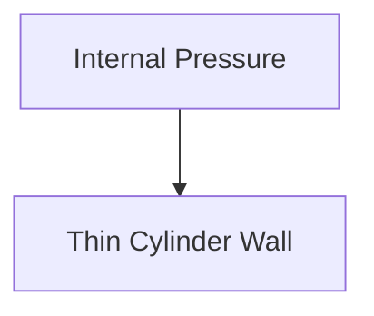
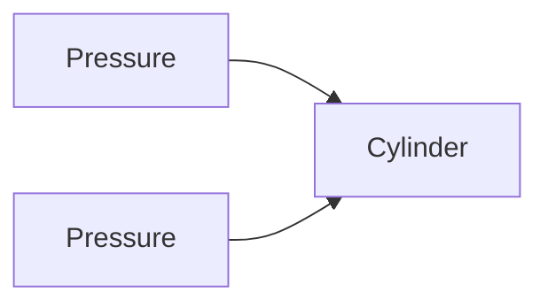

# 🛢 Thick & Thin Cylinders

Cylinders are commonly used to store fluids under pressure.

Examples include:

- Water tanks
- Gas cylinders
- Boilers
- Pressure vessels
- Hydraulic cylinders
- Air receivers

When internal pressure acts on a cylinder, stresses are developed in its walls.
The analysis of these stresses is an important part of Solid Mechanics.

---

## Why Study Cylinders?

Engineers study cylinders to:

- Design safe pressure vessels
- Prevent bursting failures
- Determine wall thickness
- Select suitable materials
- Ensure safe operation under pressure

## 📚 Classification of Cylinders

Based on wall thickness, cylinders are classified into:

## 1⃣ Thin Cylinders

Wall thickness is small compared to diameter.

Condition:

// Example demonstrating 🛢 Thick & Thin Cylinders.
```
t ≤ d/20
```

Where:

- t = Wall Thickness
- d = Internal Diameter

Examples:

- Water tanks
- Air tanks
- Domestic storage vessels

## 2⃣ Thick Cylinders

Wall thickness is relatively large.

// Example demonstrating 🛢 Thick & Thin Cylinders.
```
t > d/20
```

- Gun barrels
- Hydraulic presses
- High-pressure cylinders
- Pressure reactors

## Thin Cylinder

For thin cylinders:

- Stress is assumed uniform across thickness.
- Radial stress is neglected.
- Analysis becomes simple.

<!-- Visual flow for 🛢 Thick & Thin Cylinders. -->


## Stresses Developed in Thin Cylinders

Two major stresses are developed:

## Hoop Stress

Also called:

// Example demonstrating 🛢 Thick & Thin Cylinders.
```
Circumferential Stress
```

Acts around the circumference.

## Longitudinal Stress

Acts along the axis of the cylinder.

Hoop stress tends to split the cylinder along its length.

<!-- Visual flow for 🛢 Thick & Thin Cylinders. -->


It is the most critical stress in thin cylinders.

## Hoop Stress Formula

// Example demonstrating 🛢 Thick & Thin Cylinders.
```
σh = pd / 2t
```

- σh = Hoop Stress
- p = Internal Pressure
- d = Diameter
- t = Thickness

Longitudinal stress tends to separate the cylinder into two parts across a
transverse section.

<!-- Visual flow for 🛢 Thick & Thin Cylinders. -->
```mermaid
graph TD
A[Pressure]
B[Cylinder Axis]
C[Pressure]

## Longitudinal Stress Formula

```
σl = pd / 4t
// Example demonstrating 🛢 Thick & Thin Cylinders.
```

- σl = Longitudinal Stress

## Relationship Between Stresses

Comparing formulas:

Therefore:

```
σh = 2σl
// Example demonstrating 🛢 Thick & Thin Cylinders.
```

Important conclusion:

> Hoop stress is twice the longitudinal stress.

Hence cylinder design is generally based on hoop stress.

## Example

Given:

- Pressure = 2 MPa
- Diameter = 1000 mm
- Thickness = 10 mm

Using hoop stress formula:

```
σh = (2 × 1000)/(2 × 10)
// Example demonstrating 🛢 Thick & Thin Cylinders.
```

```
σh = 100 MPa
// Example demonstrating 🛢 Thick & Thin Cylinders.
```

Longitudinal stress:

```
σl = 50 MPa
// Example demonstrating 🛢 Thick & Thin Cylinders.
```

Result:

```
Hoop Stress = 100 MPa
Longitudinal Stress = 50 MPa
// Example demonstrating 🛢 Thick & Thin Cylinders.
```

## 📏 Thin Cylinder Design Formula

Required thickness:

```
t = pd / 2σallow
// Example demonstrating 🛢 Thick & Thin Cylinders.
```

- σallow = Allowable Stress

Used during pressure vessel design.

## Thick Cylinders

When wall thickness becomes large:

Stress distribution is no longer uniform.

Simple thin-cylinder formulas cannot be used.

## Stresses in Thick Cylinders

Three stresses exist:

Circumferential stress.

## Radial Stress

Acts from center outward.

Acts along cylinder axis.

Unlike thin cylinders, radial stress becomes significant.

Characteristics:

- Maximum at inner surface
- Minimum at outer surface

```mermaid
graph TD
A[Maximum Radial Stress]
B[Wall Thickness]
C[Minimum Radial Stress]

A --> B
B --> C
// Example demonstrating 🛢 Thick & Thin Cylinders.
```

## 📚 Lame's Theory

French engineer Gabriel Lame developed the theory for thick cylinders.

The theory provides stress distribution throughout the wall thickness.

## Lame's Equations

Radial Stress:

```
σr = A - B/r²
// Example demonstrating 🛢 Thick & Thin Cylinders.
```

Hoop Stress:

```
σh = A + B/r²
// Example demonstrating 🛢 Thick & Thin Cylinders.
```

- A and B are constants
- r = Radius at the point considered

## Stress Distribution in Thick Cylinders

```mermaid
graph TD
A[Inner Surface]
B[Middle Region]
C[Outer Surface]


- Maximum at inner surface
- Decreases toward outer surface


- Maximum internally
- Approaches zero externally

## 🚨 Failure of Cylinders

Failure may occur due to:

- Excessive hoop stress
- Yielding of material
- Fatigue
- Corrosion
- Manufacturing defects

Bursting generally starts at the inner surface where stress is highest.

## Pressure Vessels

Pressure vessels are containers designed to hold fluids under pressure.

- LPG cylinders
- Boilers
- Air receivers
- Chemical reactors

<!-- Visual flow for 🛢 Thick & Thin Cylinders. -->
```mermaid
graph LR
A[Pressure Vessel]
B[Stores Fluid Under Pressure]

A --> B
```

## 🌍 Applications of Thin Cylinders

- Water tanks
- Air compressors
- Fuel tanks
- Pipelines
- Storage vessels

## 🌍 Applications of Thick Cylinders

- Gun barrels
- Hydraulic cylinders
- Nuclear reactors
- High-pressure pumps
- Heavy industrial pressure vessels

## Thin vs Thick Cylinders

| Thin Cylinder             | Thick Cylinder              |
| ------------------------- | --------------------------- |
| t ≤ d/20                  | t > d/20                    |
| Uniform stress assumption | Non-uniform stress          |
| Radial stress neglected   | Radial stress considered    |
| Simple analysis           | Complex analysis            |
| Hoop stress dominant      | Multiple stresses important |

## Important Formulas

Thin Cylinder Hoop Stress:

Thin Cylinder Longitudinal Stress:

Relationship:

Design Thickness:

Lame's Radial Stress:

Lame's Hoop Stress:

## 🎓 Summary

Cylinders subjected to internal pressure develop stresses within their walls.

- Hoop stress and longitudinal stress are considered.
- Hoop stress is twice the longitudinal stress.

For thick cylinders:

- Stress varies across the thickness.
- Radial stress becomes important.
- Lame's theory is used for analysis.

Understanding thick and thin cylinders is essential for designing safe pressure
vessels, tanks, boilers, pipelines, and hydraulic systems.

## Quick Reference

| Area | Revision point |
|---|---|
| Definition | State exactly what the topic means. |
| Mechanism | Explain the steps that produce the result. |
| Example | Use a small realistic case. |
| Pitfalls | Know common mistakes and boundary cases. |
