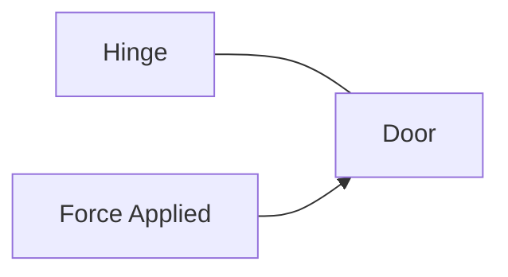
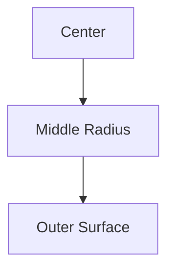

# Torsion

Torsion is the twisting of a structural member due to an applied torque or
twisting moment.

Many machine components transmit power through rotational motion. When torque is
applied, the member twists and internal shear stresses are developed.

Common examples include:

- Automobile drive shafts
- Motor shafts
- Turbine shafts
- Screwdrivers
- Drill bits

---

## Why Study Torsion?

Engineers study torsion to:

- Design safe shafts
- Transmit power efficiently
- Prevent shaft failure
- Limit excessive twisting
- Select suitable shaft dimensions

## What is Torque?

Torque is the turning or twisting effect of a force.

Formula:

// Example demonstrating Torsion.
```
T = F × r
```

Where:

- T = Torque
- F = Applied Force
- r = Perpendicular Distance from Axis

Unit:

// Example demonstrating Torsion.
```
N·m
```

or

// Example demonstrating Torsion.
```
kN·m
```

## Example of Torque

Opening a door:

<!-- Visual flow for Torsion. -->


The farther the force is applied from the hinge, the easier the door opens
because the torque increases.

## Shaft Under Torsion

Consider a circular shaft fixed at one end and subjected to torque at the other.

<!-- Visual flow for Torsion. -->


The shaft twists through a certain angle called the angle of twist.

## Effects of Torsion

When torque acts on a shaft:

1. Shear stresses develop.
2. The shaft twists.
3. Angular deformation occurs.
4. Power is transmitted.

## 📚 Assumptions of Pure Torsion Theory

The torsion equation is derived using the following assumptions:

- Material is homogeneous.
- Material is isotropic.
- Shaft is circular.
- Twist is uniform.
- Hooke's law is valid.
- Cross-sections remain plane after twisting.

## 🔬 Shear Stress in Torsion

The internal stress produced due to twisting is called shear stress.

// Example demonstrating Torsion.
```
τ
```

Characteristics:

- Zero at the center
- Maximum at the outer surface
- Varies linearly with radius

## Stress Distribution

<!-- Visual flow for Torsion. -->


Stress variation:

// Example demonstrating Torsion.
```
Center → Zero Stress
Outer Surface → Maximum Stress
```

## ⚙ Torsion Equation

The fundamental torsion equation is:

// Example demonstrating Torsion.
```
T/J = τ/R = Gθ/L
```

- T = Applied Torque
- J = Polar Moment of Inertia
- τ = Shear Stress
- R = Shaft Radius
- G = Modulus of Rigidity
- θ = Angle of Twist
- L = Length of Shaft

## Shear Stress Formula

From the torsion equation:

// Example demonstrating Torsion.
```
τ = TR/J
```

- τ = Maximum Shear Stress
- T = Torque
- R = Outer Radius
- J = Polar Moment of Inertia

## 📏 Polar Moment of Inertia

The resistance offered by a section against twisting is measured by its polar
moment of inertia.

## Solid Circular Shaft

// Example demonstrating Torsion.
```
J = πd⁴/32
```

- d = Diameter

## Hollow Circular Shaft

// Example demonstrating Torsion.
```
J = π(D⁴-d⁴)/32
```

- D = Outer Diameter
- d = Inner Diameter

## Angle of Twist

The angular rotation produced by torque is called angle of twist.

// Example demonstrating Torsion.
```
θ = TL/GJ
```

- θ = Angle of Twist
- T = Torque
- L = Length
- G = Modulus of Rigidity
- J = Polar Moment of Inertia

// Example demonstrating Torsion.
```
Radians
```

## 🔗 Modulus of Rigidity

Also called:

// Example demonstrating Torsion.
```
Shear Modulus
```

Represented by:

// Example demonstrating Torsion.
```
G
```

// Example demonstrating Torsion.
```
G = τ/γ
```

- τ = Shear Stress
- γ = Shear Strain

Higher G means higher resistance to twisting.

## Power Transmission by Shafts

Rotating shafts transmit power from one machine element to another.

Examples:

- Engine to gearbox
- Turbine to generator
- Electric motor to machinery

## Power-Torque Relationship

// Example demonstrating Torsion.
```
P = 2πNT/60
```

- P = Power (W)
- N = Speed (RPM)
- T = Torque (N·m)

This equation is widely used in machine design.

## Example

Given:

- Torque = 1000 N·m
- Speed = 600 RPM

Using:

// Example demonstrating Torsion.
```
P = 2 × π × 600 × 1000 / 60
```

// Example demonstrating Torsion.
```
P ≈ 62.8 kW
```

Therefore:

// Example demonstrating Torsion.
```
Power ≈ 62.8 kW
```

## Solid vs Hollow Shafts

| Solid Shaft                    | Hollow Shaft                    |
| ------------------------------ | ------------------------------- |
| More material                  | Less material                   |
| Heavier                        | Lighter                         |
| Lower strength-to-weight ratio | Higher strength-to-weight ratio |
| Lower efficiency               | Better efficiency               |

## ⭐ Why Hollow Shafts Are Preferred?

Because most torsional stress exists near the outer surface.

The center region contributes very little to torsional resistance.

- Weight is reduced
- Material is saved
- Strength remains high

- Automobile drive shafts
- Aircraft components
- Bicycle frames

## Failure in Torsion

A shaft may fail due to:

- Excessive shear stress
- Excessive twisting
- Fatigue loading
- Sudden shock loads

Engineers design shafts within allowable stress limits.

## Automobile Drive Shaft

Transfers power from gearbox to wheels.

## Electric Motor Shaft

Transmits rotational power.

## Turbine Rotor Shaft

Carries very high torque.

## Screwdriver

Transfers torque from hand to screw.

## Drill Machine

Applies torsion to drill bits.

## Important Formulas

Torque:

Torsion Equation:

Maximum Shear Stress:

Angle of Twist:

Power Transmission:

Polar Moment for Solid Shaft:

Polar Moment for Hollow Shaft:

## 🎓 Summary

Torsion is the twisting of a member due to an applied torque.

Key points:

- Torque produces shear stress.
- Stress is maximum at the outer surface.
- Circular shafts are commonly used for power transmission.
- Hollow shafts provide better strength-to-weight ratio.
- The torsion equation forms the basis of shaft design.

Torsion analysis is essential in machine design, automotive engineering,
aerospace systems, and power transmission equipment.

## Quick Reference

| Area | Revision point |
|---|---|
| Definition | State exactly what the topic means. |
| Mechanism | Explain the steps that produce the result. |
| Example | Use a small realistic case. |
| Pitfalls | Know common mistakes and boundary cases. |
