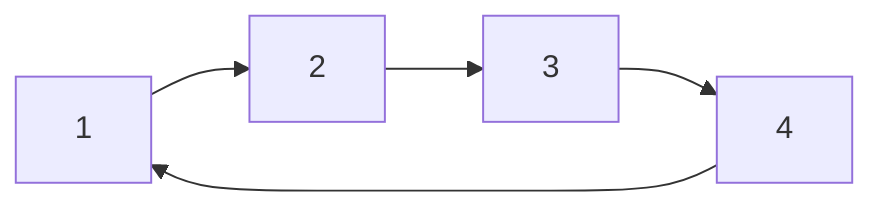
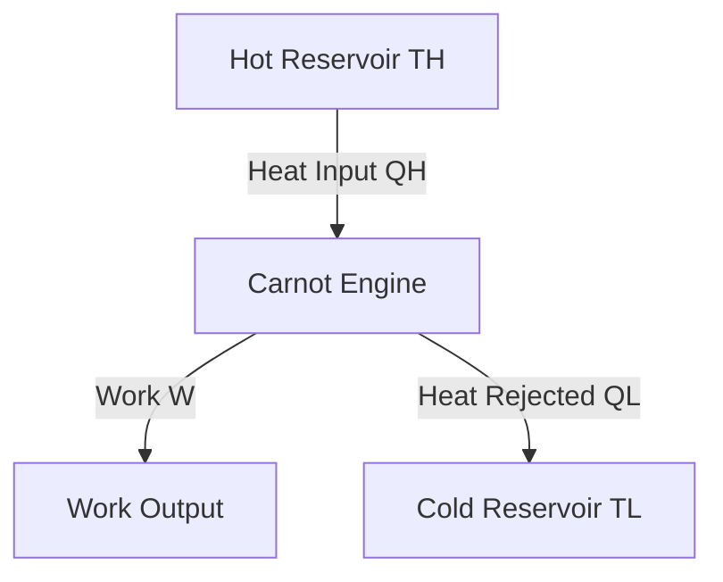
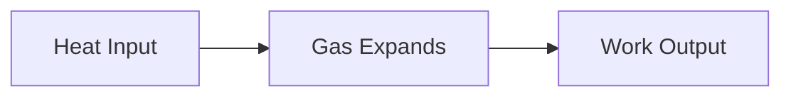
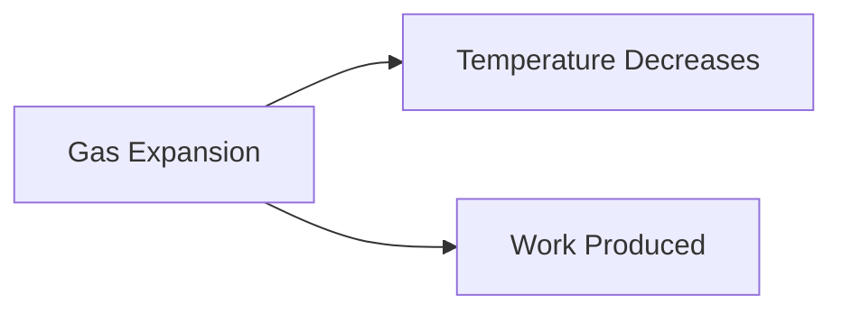
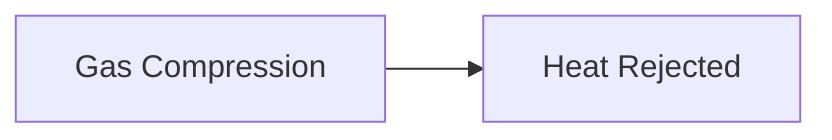

# ⚙ Carnot Cycle

The Carnot Cycle is an ideal thermodynamic cycle proposed by the French engineer
and physicist **Sadi Carnot** in 1824.

It represents the **most efficient heat engine possible** operating between two
temperature reservoirs.

Although no real engine can achieve Carnot efficiency, it serves as the
benchmark against which all heat engines are compared.

## Definition

The Carnot Cycle is a completely reversible cycle consisting of four reversible
processes:

1. Isothermal Expansion
2. Adiabatic Expansion
3. Isothermal Compression
4. Adiabatic Compression

<!-- Visual flow for ⚙ Carnot Cycle. -->


The system returns to its initial state after completing the cycle.

---

## 🌡 Working Principle

The Carnot engine operates between:

- A high-temperature reservoir (\`T_H\`)
- A low-temperature reservoir (\`T_L\`)

The engine:

- Absorbs heat from the hot reservoir
- Converts part of the heat into work
- Rejects the remaining heat to the cold reservoir

<!-- Visual flow for ⚙ Carnot Cycle. -->


## 1⃣ Isothermal Expansion (1 → 2)

During this process:

- Temperature remains constant at \`T_H\`
- Heat is absorbed from the hot reservoir
- Gas expands
- Work is done by the system

Characteristics:

- Temperature constant
- Volume increases
- Pressure decreases

<!-- Visual flow for ⚙ Carnot Cycle. -->


## 2⃣ Adiabatic Expansion (2 → 3)

- No heat transfer occurs
- Gas continues expanding
- Temperature decreases
- Pressure decreases

- Q = 0
- Volume increases
- Temperature falls from TH to TL

<!-- Visual flow for ⚙ Carnot Cycle. -->


## 3⃣ Isothermal Compression (3 → 4)

- Temperature remains constant at \`T_L\`
- Heat is rejected to the cold reservoir
- Gas is compressed

- Temperature constant
- Volume decreases
- Pressure increases

<!-- Visual flow for ⚙ Carnot Cycle. -->


## 4⃣ Adiabatic Compression (4 → 1)

- No heat transfer occurs
- Gas is compressed
- Temperature increases from TL to TH

- Q = 0
- Volume decreases
- Pressure increases

<!-- Visual flow for ⚙ Carnot Cycle. -->


## Complete Cycle Overview

<!-- Visual flow for ⚙ Carnot Cycle. -->
```mermaid
flowchart TD
    A[1 Isothermal Expansion]
    B[2 Adiabatic Expansion]
    C[3 Isothermal Compression]
    D[4 Adiabatic Compression]

## 📈 P-V Diagram

The Carnot cycle is often represented on a Pressure-Volume diagram.

The enclosed area represents the net work produced during one cycle.

## 🌡 T-S Diagram

The Temperature-Entropy diagram clearly illustrates heat transfer.

```mermaid
flowchart LR
    A[TH]
    B[Heat Addition]
    C[TL]
    D[Heat Rejection]

A --> B
    B --> C
    C --> D
// Example demonstrating ⚙ Carnot Cycle.
```

The area enclosed on the T-S diagram represents net work output.

## Carnot Efficiency

The efficiency of a Carnot engine depends only on the temperatures of the two
reservoirs.

```
η = 1 - (TL / TH)
// Example demonstrating ⚙ Carnot Cycle.
```

Where:

- η = Thermal Efficiency
- TH = Hot Reservoir Temperature (K)
- TL = Cold Reservoir Temperature (K)

### Important Notes

- Temperatures must be in Kelvin.
- Efficiency increases when TH increases.
- Efficiency increases when TL decreases.

## 🧮 Example

Suppose:

- TH = 600 K
- TL = 300 K

Using:

```
η = 1 - (300 / 600)
// Example demonstrating ⚙ Carnot Cycle.
```

```
η = 0.5
// Example demonstrating ⚙ Carnot Cycle.
```

```
η = 50%
// Example demonstrating ⚙ Carnot Cycle.
```

### Result

The maximum possible efficiency is 50%.

No real engine operating between these temperatures can exceed this efficiency.

## Why Is Carnot Cycle Important?

The Carnot Cycle establishes the theoretical upper limit of efficiency.

It helps engineers:

- Evaluate engine performance
- Compare heat engines
- Analyze thermodynamic systems
- Design efficient power plants

## ❌ Limitations of the Carnot Cycle

Although highly efficient, it is not practical.

Reasons:

### Extremely Slow Operation

Reversible processes require infinite time.

### Perfect Insulation Required

Adiabatic processes require ideal insulation.

### No Friction Allowed

Real systems always experience friction.

### Not Suitable for High Power Output

Power generation would be extremely low.

## 🏭 Applications

The Carnot Cycle is mainly used as a theoretical model.

Applications include:

### 📚 Thermodynamic Analysis

Used to study engine efficiency limits.

### 🏭 Power Plant Design

Provides a benchmark for evaluating actual performance.

### ❄ Refrigeration Theory

Forms the basis of the Carnot refrigeration cycle.

### 🎓 Engineering Education

Used extensively in thermodynamics courses.

## Carnot Cycle vs Real Heat Engine

| Feature     | Carnot Cycle     | Real Engine |
| ----------- | ---------------- | ----------- |
| Reversible  | Yes              | No          |
| Friction    | None             | Present     |
| Efficiency  | Maximum Possible | Lower       |
| Practical   | No               | Yes         |
| Heat Losses | None             | Present     |

## Key Points

✅ Carnot Cycle is the most efficient theoretical heat engine.

✅ It consists of four reversible processes.

✅ Two processes are isothermal.

✅ Two processes are adiabatic.

✅ Efficiency depends only on reservoir temperatures.

✅ No real engine can exceed Carnot efficiency.

## 📚 Quick Summary

The Carnot Cycle is an ideal reversible thermodynamic cycle that provides the
maximum possible efficiency for a heat engine operating between two
temperatures. It consists of two isothermal and two adiabatic processes and
serves as the benchmark for all real heat engines and power plants.

## Quick Reference

| Area | Revision point |
|---|---|
| Definition | State exactly what the topic means. |
| Mechanism | Explain the steps that produce the result. |
| Example | Use a small realistic case. |
| Pitfalls | Know common mistakes and boundary cases. |
