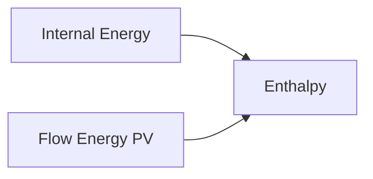
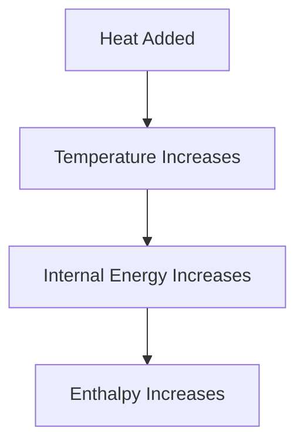
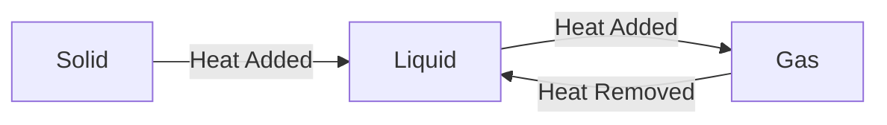

# 🔥 Enthalpy

Enthalpy is a thermodynamic property that represents the **total heat content**
of a system. It is especially useful when analyzing processes that occur at
constant pressure, such as boilers, turbines, condensers, and heat exchangers.

Enthalpy combines a system's internal energy and the energy required to make
room for it by displacing its surroundings.

The symbol for enthalpy is:

```
H
```

## What is Enthalpy?

Enthalpy is defined as:

```
H = U + PV
```

Where:

- H = Enthalpy
- U = Internal Energy
- P = Pressure
- V = Volume

This equation shows that enthalpy includes:

- Internal energy stored in the system
- Flow energy (PV energy)

## 🌡 Why Do We Need Enthalpy?

In many engineering systems, fluids flow continuously.

Examples:

- Steam turbines
- Boilers
- Compressors
- Pumps
- Heat exchangers

For flowing fluids, internal energy alone is not sufficient. We must also
account for the energy required to push the fluid into or out of the system.

This combined energy is called enthalpy.

<!-- Visual flow for 🔥 Enthalpy. -->


## Understanding Flow Energy

Consider water flowing through a pipe.

To move the water forward:

- Pressure must be applied.
- Energy is required to push the fluid.

This energy is called **flow energy**.

```
Flow Energy = PV
```

Therefore:

```
Enthalpy = Internal Energy + Flow Energy
```

## 🧮 Specific Enthalpy

In engineering, specific enthalpy is commonly used.

Specific enthalpy is enthalpy per unit mass.

- h = Specific Enthalpy (kJ/kg)
- u = Specific Internal Energy (kJ/kg)
- P = Pressure
- v = Specific Volume (m³/kg)

### Total Enthalpy

```
Joule (J)
```

### Specific Enthalpy

```
kJ/kg
```

Specific enthalpy is widely used in thermodynamic tables and engineering
calculations.

## 🔥 Enthalpy Change

Most practical applications involve enthalpy change rather than absolute
enthalpy.

```
ΔH = H₂ - H₁
```

- H₁ = Initial Enthalpy
- H₂ = Final Enthalpy

### Interpretation

- Positive ΔH → Heat absorbed
- Negative ΔH → Heat released

## 🌡 Constant Pressure Process

At constant pressure:

```
Q = ΔH
```

This means the heat transferred equals the change in enthalpy.

This is one reason enthalpy is extremely useful in engineering calculations.

<!-- Visual flow for 🔥 Enthalpy. -->


## ☕ Example: Heating Water

Suppose water is heated in an open container.

As heat is supplied:

- Temperature rises.
- Internal energy increases.
- Enthalpy increases.

<!-- Visual flow for 🔥 Enthalpy. -->


## 💨 Enthalpy in Phase Changes

Enthalpy plays a major role during phase changes.

### Melting

Solid → Liquid

Heat is absorbed.

Enthalpy increases.

### Vaporization

Liquid → Vapor

Large amounts of heat are absorbed.

Enthalpy increases significantly.

### Condensation

Vapor → Liquid

Heat is released.

Enthalpy decreases.

<!-- Visual flow for 🔥 Enthalpy. -->


## 💧 Steam Enthalpy

Steam power plants heavily rely on enthalpy values.

Steam undergoes:

1. Heating in a boiler
2. Expansion in a turbine
3. Condensation in a condenser
4. Pumping back to the boiler

Enthalpy changes are used to calculate:

- Work output
- Heat transfer
- Efficiency

## 🏭 Enthalpy in Boilers

A boiler adds heat to water.

<!-- Visual flow for 🔥 Enthalpy. -->


Result:

- Temperature increases.
- Enthalpy increases.

Heat supplied is reflected as an increase in enthalpy.

## ⚙ Enthalpy in Turbines

Steam enters a turbine with high enthalpy.

As steam expands:

- Enthalpy decreases.
- Useful work is produced.

<!-- Visual flow for 🔥 Enthalpy. -->


## ❄ Enthalpy in Refrigeration

Refrigeration cycles are analyzed using enthalpy differences.

Enthalpy helps determine:

- Cooling effect
- Compressor work
- System performance

## 📈 Enthalpy-Temperature Relationship

In many substances:

- Increasing temperature increases enthalpy.
- Decreasing temperature decreases enthalpy.

<!-- Visual flow for 🔥 Enthalpy. -->


## Enthalpy vs Internal Energy

| Property                  | Internal Energy | Enthalpy    |
| ------------------------- | --------------- | ----------- |
| Symbol                    | U               | H           |
| Includes Molecular Energy | ✅              | ✅          |
| Includes Flow Energy      | ❌              | ✅          |
| Formula                   | U               | U + PV      |
| Used in Flow Systems      | Limited         | Widely Used |

### 🏭 Power Plants

Used to analyze steam generation and turbine work.

### 🚗 Internal Combustion Engines

Helps evaluate energy transfer during combustion.

### ❄ Refrigeration Systems

Used to calculate cooling capacity and efficiency.

### ⚙ Heat Exchangers

Determines heat transfer between fluids.

### ✈ Gas Turbines

Used to evaluate work output and performance.

## Key Points

✅ Enthalpy represents the total heat content of a system.

✅ Enthalpy is defined as:

H = U + PV

✅ It includes internal energy and flow energy.

✅ Enthalpy change is important in engineering calculations.

✅ At constant pressure, heat transfer equals enthalpy change.

✅ Enthalpy is widely used in boilers, turbines, compressors, and refrigeration
systems.

## 📚 Quick Summary

Enthalpy is a thermodynamic property that combines internal energy and flow
energy. It represents the total energy content of a system and is especially
useful for analyzing flowing fluids and constant-pressure processes. Engineers
use enthalpy extensively in power plants, refrigeration systems, turbines,
boilers, and heat exchangers.

## Quick Reference

| Area | Revision point |
|---|---|
| Definition | State exactly what the topic means. |
| Mechanism | Explain the steps that produce the result. |
| Example | Use a small realistic case. |
| Pitfalls | Know common mistakes and boundary cases. |
