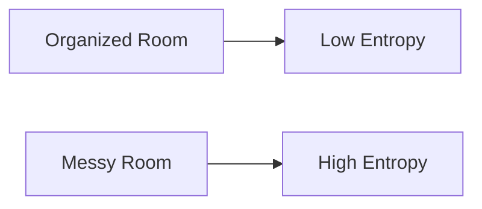
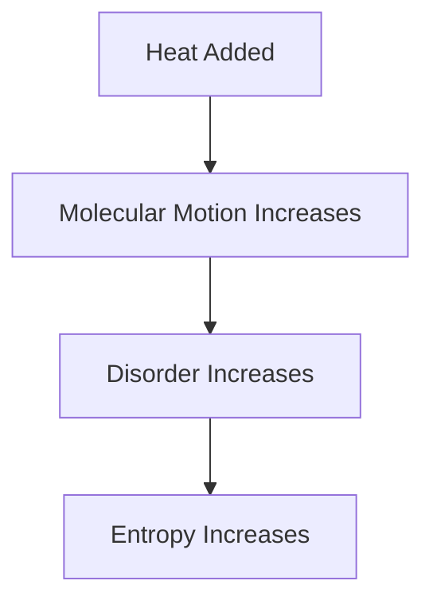

# 📈 Entropy

Entropy is one of the most important concepts in thermodynamics. It helps
explain why some processes occur naturally while others do not.

In simple terms, entropy is a measure of the **randomness**, **disorder**, or
**energy unavailability** within a system.

Entropy was introduced by the German physicist Rudolf Clausius and is
represented by the symbol:

// Example demonstrating 📈 Entropy.
```
S
```

## What is Entropy?

Entropy indicates how dispersed or spread out energy is within a system.

- High disorder → High entropy
- Low disorder → Low entropy

### Simple Example

Consider two rooms:

- A clean and organized room has low entropy.
- A messy room has high entropy.

<!-- Visual flow for 📈 Entropy. -->


## 🌍 Entropy in Nature

Natural processes tend to move toward greater disorder.

Examples:

- Ice melts into water.
- Perfume spreads throughout a room.
- Hot coffee cools down.
- Gases mix naturally.

All of these processes increase entropy.

## ☕ Example: Hot Coffee Cooling

When hot coffee is placed in a room:

- Heat flows from coffee to the surroundings.
- Energy becomes more evenly distributed.
- Entropy increases.

<!-- Visual flow for 📈 Entropy. -->


## 🧊 Example: Ice Melting

Ice has a highly ordered molecular structure.

When it melts:

- Molecules become freer to move.
- Disorder increases.
- Entropy increases.

<!-- Visual flow for 📈 Entropy. -->


## 🔥 Entropy and Heat Transfer

Whenever heat is transferred, entropy changes.

For a reversible process:

// Example demonstrating 📈 Entropy.
```
ΔS = Qrev / T
```

Where:

- ΔS = Change in entropy
- Qrev = Reversible heat transfer
- T = Absolute temperature (Kelvin)

### Interpretation

- Heat added → Entropy increases
- Heat removed → Entropy decreases

## Units of Entropy

SI Unit:

// Example demonstrating 📈 Entropy.
```
J/K
```

Common Engineering Unit:

// Example demonstrating 📈 Entropy.
```
kJ/kg·K
```

### Positive Entropy Change

Occurs when disorder increases.

- Melting
- Evaporation
- Gas expansion
- Heat addition

<!-- Visual flow for 📈 Entropy. -->


### Negative Entropy Change

Occurs when disorder decreases.

- Freezing
- Condensation
- Cooling

<!-- Visual flow for 📈 Entropy. -->
```mermaid
flowchart TD
    A[Cooling]
    B[Molecular Motion Decreases]
    C[Order Increases]
    D[Entropy Decreases]

## 🌡 Entropy and Temperature

Entropy generally increases with temperature.

Why?

As temperature rises:

- Molecules move faster.
- Randomness increases.
- More energy states become available.

```mermaid
flowchart LR
    T[Temperature Increases]
    M[Molecular Motion Increases]
    S[Entropy Increases]

T --> M --> S
// Example demonstrating 📈 Entropy.
```

## Entropy of Different States of Matter

Entropy is lowest in solids and highest in gases.

```mermaid
flowchart LR
    S[Solid]
    L[Liquid]
    G[Gas]

S --> L --> G
// Example demonstrating 📈 Entropy.
```

### Order Comparison

| State  | Molecular Order | Entropy |
| ------ | --------------- | ------- |
| Solid  | Highest         | Lowest  |
| Liquid | Moderate        | Medium  |
| Gas    | Lowest          | Highest |

## Entropy and Reversible Processes

A reversible process occurs very slowly and without losses.

```
dS = δQrev / T
// Example demonstrating 📈 Entropy.
```

This equation forms the basis of entropy calculations in thermodynamics.

## ⚠ Entropy and Irreversible Processes

Real processes are irreversible.

- Friction
- Combustion
- Mixing of fluids
- Heat transfer across finite temperature differences

Irreversible processes always generate entropy.

```mermaid
flowchart TD
    A[Real Process]
    B[Friction]
    C[Heat Loss]
    D[Entropy Generation]

A --> B
    A --> C
    B --> D
    C --> D
// Example demonstrating 📈 Entropy.
```

## 🌍 Entropy and the Second Law

The Second Law of Thermodynamics states:

**The entropy of an isolated system never decreases.**

Mathematically:

```
ΔS ≥ 0
// Example demonstrating 📈 Entropy.
```

Meaning:

- Entropy can increase.
- Entropy can remain constant.
- Entropy cannot decrease in an isolated system.

## ⚙ Entropy Generation

Entropy generation is a measure of energy degradation.

Sources include:

- Friction
- Turbulence
- Mixing
- Heat losses
- Electrical resistance

Lower entropy generation generally means higher efficiency.

### 🚗 Automobile Engines

Used to evaluate engine efficiency and losses.

### 🏭 Power Plants

Helps identify energy destruction and inefficiencies.

### ❄ Refrigeration Systems

Used to analyze cooling cycles and performance.

### ✈ Gas Turbines

Entropy analysis helps optimize turbine operation.

### Energy Systems

Used to improve energy utilization and reduce waste.

## Entropy vs Energy

| Property  | Energy             | Entropy            |
| --------- | ------------------ | ------------------ |
| Symbol    | E or U             | S                  |
| Conserved | Yes                | No                 |
| Measures  | Ability to do work | Degree of disorder |
| Unit      | Joule (J)          | J/K                |

## Key Points

✅ Entropy measures disorder and energy dispersal.

✅ Natural processes tend to increase entropy.

✅ Solids have lower entropy than gases.

✅ Entropy increases with temperature.

✅ Irreversible processes generate entropy.

✅ The Second Law states that entropy of an isolated system never decreases.

## 📚 Quick Summary

Entropy is a thermodynamic property that measures the degree of disorder or
randomness in a system. It helps determine the direction of natural processes
and explains why energy becomes less available for useful work over time.
Understanding entropy is essential for analyzing engines, power plants,
refrigeration systems, and all real-world thermodynamic processes.

## Quick Reference

| Area | Revision point |
|---|---|
| Definition | State exactly what the topic means. |
| Mechanism | Explain the steps that produce the result. |
| Example | Use a small realistic case. |
| Pitfalls | Know common mistakes and boundary cases. |
