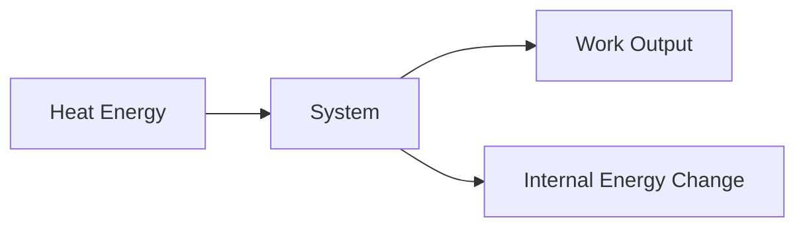
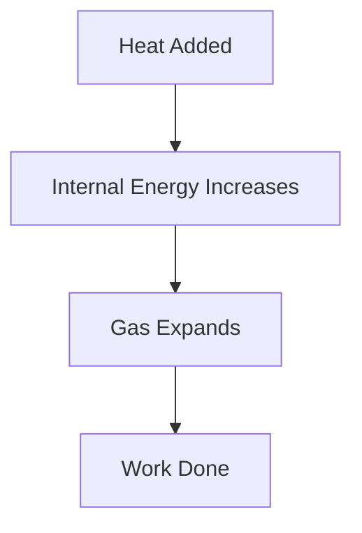

# 1⃣ First Law of Thermodynamics

The First Law of Thermodynamics is based on the **Law of Conservation of
Energy**. It states that energy cannot be created or destroyed; it can only be
transferred or converted from one form to another.

This law explains the relationship between **heat**, **work**, and **internal
energy** of a system.

## Statement

**The change in internal energy of a system is equal to the heat added to the
system minus the work done by the system.**

## Energy Conservation Concept

Energy can change forms, but the total amount of energy remains constant.

Examples:

- A car engine converts heat energy into mechanical work.
- A heater converts electrical energy into heat.
- A turbine converts thermal energy into mechanical energy.

<!-- Visual flow for 1⃣ First Law of Thermodynamics. -->


## 🧮 Mathematical Expression

The First Law is commonly written as:

ΔU = Q - W

Where:

- ΔU = Change in Internal Energy
- Q = Heat Added to the System
- W = Work Done by the System

### Interpretation

- Heat added to the system increases internal energy.
- Work done by the system decreases internal energy.
- If heat input equals work output, internal energy remains unchanged.

## 🔥 Understanding Internal Energy

Internal energy is the microscopic energy stored within a substance due to:

- Molecular motion
- Molecular vibration
- Molecular rotation
- Intermolecular forces

It is represented by **U**.

## Closed System Analysis

For a closed system:

// Example demonstrating 1⃣ First Law of Thermodynamics.
```
ΔU = Q - W
```

<!-- Visual flow for 1⃣ First Law of Thermodynamics. -->


Mass cannot enter or leave the system, but heat and work can cross the boundary.

## 🚗 Example: Gas in a Cylinder

Consider a gas enclosed in a piston-cylinder arrangement.

### Step 1

Heat is supplied to the gas.

### Step 2

Gas molecules move faster.

### Step 3

Pressure increases.

### Step 4

The gas expands and pushes the piston upward.

### Result

- Part of the heat increases internal energy.
- Part of the heat is converted into work.

<!-- Visual flow for 1⃣ First Law of Thermodynamics. -->


### Case 1: Constant Volume Process

When volume remains constant:

- No boundary work is done.
- W = 0

Therefore:

ΔU = Q

All supplied heat increases internal energy.

<!-- Visual flow for 1⃣ First Law of Thermodynamics. -->


### Case 2: Adiabatic Process

In an adiabatic process:

- No heat transfer occurs.
- Q = 0

ΔU = -W

Work is done using the system's internal energy.

<!-- Visual flow for 1⃣ First Law of Thermodynamics. -->


### Case 3: Cyclic Process

A cyclic process returns to its initial state.

Since internal energy is a state property:

ΔU = 0

Q = W

Net heat supplied equals net work done.

<!-- Visual flow for 1⃣ First Law of Thermodynamics. -->


### 🚗 Internal Combustion Engines

Fuel energy is converted into:

- Mechanical work
- Heat losses

### 🏭 Power Plants

Thermal energy from steam is converted into useful work and electricity.

### ❄ Refrigerators

Work is supplied to transfer heat from a cold region to a hot region.

### ✈ Gas Turbines

Heat energy is transformed into shaft work.

## Numerical Example

A system receives 500 J of heat and performs 200 J of work.

Given:

- Q = 500 J
- W = 200 J

Using:

ΔU = 500 - 200

ΔU = 300 J

The internal energy of the system increases by 300 J.

### Heat is Not Stored

Heat is energy in transit due to temperature difference.

### Internal Energy Can Be Stored

Internal energy exists within the system.

### Work is Not a Property

Work depends on the path followed during a process.

## Key Points

✅ First Law is based on conservation of energy.

✅ Energy cannot be created or destroyed.

✅ Heat supplied can increase internal energy or produce work.

✅ Internal energy is a property of the system.

✅ Heat and work are modes of energy transfer.

## 📚 Quick Summary

The First Law of Thermodynamics states that energy is conserved. Any heat
supplied to a system is either stored as internal energy or converted into work.
This principle forms the basis for analyzing engines, turbines, compressors,
refrigerators, and nearly every thermodynamic system.

## Quick Reference

| Area | Revision point |
|---|---|
| Definition | State exactly what the topic means. |
| Mechanism | Explain the steps that produce the result. |
| Example | Use a small realistic case. |
| Pitfalls | Know common mistakes and boundary cases. |
