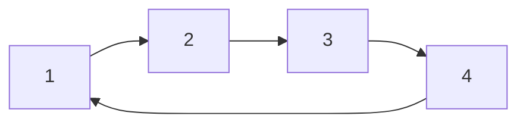
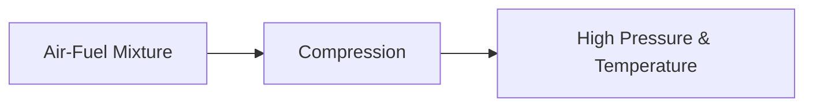

# 🚗 Otto & Diesel Cycles

The Otto Cycle and Diesel Cycle are two of the most important thermodynamic
cycles used in internal combustion engines.

- The **Otto Cycle** represents the ideal cycle of petrol (gasoline) engines.
- The **Diesel Cycle** represents the ideal cycle of diesel engines.

Both cycles convert the chemical energy of fuel into mechanical work, but they
differ in how combustion occurs.

---

## 🚗 Otto Cycle

The Otto Cycle is the ideal thermodynamic cycle for spark-ignition (SI) engines.

Examples:

- Cars
- Motorcycles
- Scooters
- Small gasoline generators

In an Otto engine:

- Air and fuel are mixed before combustion.
- A spark plug ignites the mixture.
- Combustion occurs rapidly at nearly constant volume.

## ⚙ Processes of Otto Cycle

The Otto Cycle consists of four processes.

<!-- Visual flow for 🚗 Otto & Diesel Cycles. -->


## 1⃣ Isentropic Compression (1 → 2)

The piston compresses the air-fuel mixture.

Characteristics:

- Pressure increases
- Temperature increases
- Volume decreases
- No heat transfer

<!-- Visual flow for 🚗 Otto & Diesel Cycles. -->


## 2⃣ Constant Volume Heat Addition (2 → 3)

The spark plug ignites the mixture.

- Rapid combustion
- Heat added
- Volume remains constant
- Pressure rises sharply

<!-- Visual flow for 🚗 Otto & Diesel Cycles. -->


## 3⃣ Isentropic Expansion (3 → 4)

The high-pressure gases expand and push the piston downward.

- Useful work produced
- Pressure decreases
- Temperature decreases

<!-- Visual flow for 🚗 Otto & Diesel Cycles. -->


## 4⃣ Constant Volume Heat Rejection (4 → 1)

Exhaust gases release heat.

- Heat rejected
- Volume remains constant
- Cycle returns to initial state

<!-- Visual flow for 🚗 Otto & Diesel Cycles. -->


## 📈 Otto Cycle P-V Diagram

<!-- Visual flow for 🚗 Otto & Diesel Cycles. -->
```mermaid
flowchart TD
    A[1 Compression Start]
    B[2 Compression End]
    C[3 Combustion]
    D[4 Expansion End]

## Otto Cycle Efficiency

The thermal efficiency of the Otto Cycle is:

```
η = 1 - (1 / r^(γ-1))
// Example demonstrating 🚗 Otto & Diesel Cycles.
```

Where:

- η = Thermal Efficiency
- r = Compression Ratio
- γ = Specific Heat Ratio

### Observation

Higher compression ratio → Higher efficiency

## 🚚 Diesel Cycle

The Diesel Cycle is the ideal thermodynamic cycle for compression-ignition (CI)
engines.

- Trucks
- Buses
- Tractors
- Ships
- Heavy machinery

In a diesel engine:

- Only air is compressed.
- Fuel is injected near the end of compression.
- Combustion occurs due to high temperature created by compression.

## ⚙ Processes of Diesel Cycle

The Diesel Cycle consists of four processes.

Only air is compressed.

- Pressure increases
- Temperature increases
- Volume decreases

```mermaid
flowchart LR
    A[Air]
    B[Compression]
    C[High Temperature]

## 2⃣ Constant Pressure Heat Addition (2 → 3)

Fuel is injected into hot compressed air.

Combustion begins automatically.

- Heat added
- Pressure remains nearly constant
- Volume increases

<!-- Visual flow for 🚗 Otto & Diesel Cycles. -->
```mermaid
flowchart LR
    F[Fuel Injection]
    C[Combustion]
    P[Constant Pressure]

F --> C --> P
```

Hot gases expand and perform work.

- Work output produced
- Pressure decreases
- Temperature decreases

<!-- Visual flow for 🚗 Otto & Diesel Cycles. -->
```mermaid
flowchart LR
    G[Hot Gas]
    E[Expansion]
    W[Work Output]

Heat is rejected to surroundings.

The cycle returns to its initial state.

```mermaid
flowchart LR
    H[Heat Rejection]
    I[Initial State]

## 📈 Diesel Cycle P-V Diagram

<!-- Visual flow for 🚗 Otto & Diesel Cycles. -->
```mermaid
flowchart TD
    A[1 Compression Start]
    B[2 Compression End]
    C[3 Fuel Combustion]
    D[4 Expansion End]

## Diesel Cycle Efficiency

The efficiency of the Diesel Cycle is:

```
η = 1 - (1 / r^(γ-1)) × ((ρ^γ - 1) / (γ(ρ - 1)))
// Example demonstrating 🚗 Otto & Diesel Cycles.
```

- η = Thermal Efficiency
- r = Compression Ratio
- ρ = Cut-off Ratio
- γ = Specific Heat Ratio

## Otto Cycle vs Diesel Cycle

| Feature           | Otto Cycle         | Diesel Cycle         |
| ----------------- | ------------------ | -------------------- |
| Engine Type       | Petrol Engine      | Diesel Engine        |
| Ignition Method   | Spark Plug         | Compression Ignition |
| Heat Addition     | Constant Volume    | Constant Pressure    |
| Fuel-Air Mixing   | Before Compression | Fuel Injected Later  |
| Compression Ratio | Lower              | Higher               |
| Efficiency        | Lower              | Higher               |
| Weight            | Lighter            | Heavier              |
| Fuel Economy      | Lower              | Better               |

## 🚗 Four-Stroke Engine Relation

Both Otto and Diesel cycles are commonly implemented using four strokes:

1. Intake Stroke
2. Compression Stroke
3. Power Stroke
4. Exhaust Stroke

```mermaid
flowchart LR
    I[Intake]
    C[Compression]
    P[Power]
    E[Exhaust]

I --> C --> P --> E
// Example demonstrating 🚗 Otto & Diesel Cycles.
```

## Otto Cycle Applications

- Cars
- Motorcycles
- Portable generators
- Lawn mowers

## Diesel Cycle Applications

- Trucks
- Buses
- Trains
- Ships
- Construction equipment
- Power generators

## Key Points

✅ Otto Cycle represents petrol engines.

✅ Diesel Cycle represents diesel engines.

✅ Otto Cycle uses spark ignition.

✅ Diesel Cycle uses compression ignition.

✅ Otto Cycle adds heat at constant volume.

✅ Diesel Cycle adds heat at constant pressure.

✅ Diesel engines generally have higher efficiency.

✅ Both cycles convert fuel energy into mechanical work.

## 📚 Quick Summary

The Otto Cycle and Diesel Cycle are ideal thermodynamic models for petrol and
diesel engines. The Otto Cycle uses spark ignition and constant-volume heat
addition, while the Diesel Cycle uses compression ignition and constant-pressure
heat addition. These cycles form the foundation of modern transportation and
power-generation engines.

## Quick Reference

| Area | Revision point |
|---|---|
| Definition | State exactly what the topic means. |
| Mechanism | Explain the steps that produce the result. |
| Example | Use a small realistic case. |
| Pitfalls | Know common mistakes and boundary cases. |
