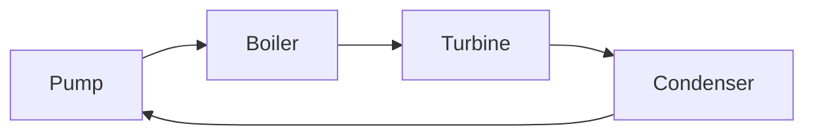
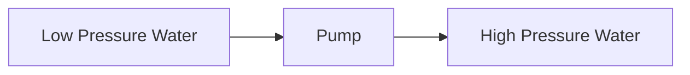
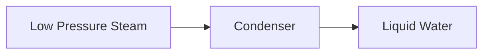
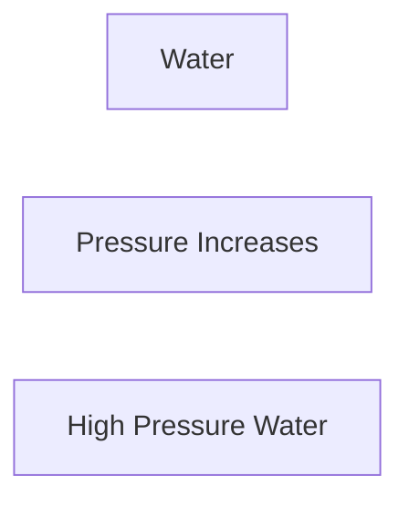
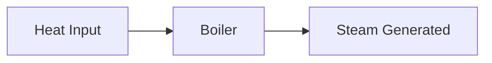
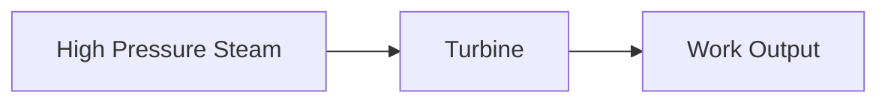
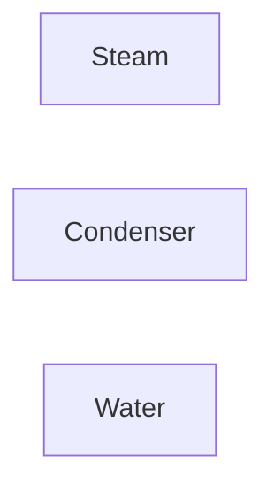
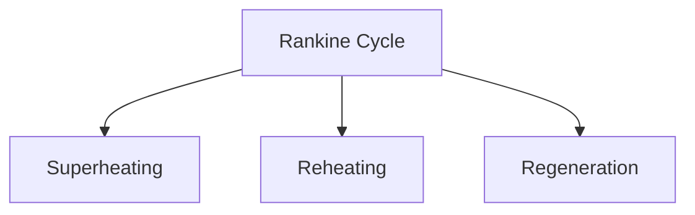

# Rankine Cycle

The Rankine Cycle is the fundamental operating cycle of most steam power plants.
It converts heat energy into mechanical work and then into electrical energy.

Unlike the Carnot Cycle, the Rankine Cycle is practical and widely used in
thermal power stations, nuclear power plants, and industrial steam systems.

## What is the Rankine Cycle?

The Rankine Cycle is a thermodynamic cycle in which water is used as the working
fluid.

The cycle consists of four main processes:

1. Pumping
2. Heat Addition in Boiler
3. Expansion in Turbine
4. Heat Rejection in Condenser

After completing these processes, the water returns to its initial state and the
cycle repeats.

<!-- Visual flow for Rankine Cycle. -->


---

## 1⃣ Pump

The pump increases the pressure of the liquid water before it enters the boiler.

### Functions

- Raises water pressure
- Requires small work input
- Delivers high-pressure water to the boiler

<!-- Visual flow for Rankine Cycle. -->


## 2⃣ Boiler

The boiler adds heat to the high-pressure water.

Inside the boiler:

- Water is heated
- Water converts into steam
- Steam may be superheated

- Supplies thermal energy
- Produces high-temperature steam

<!-- Visual flow for Rankine Cycle. -->


## 3⃣ Turbine

The high-pressure steam expands through the turbine.

During expansion:

- Pressure decreases
- Temperature decreases
- Enthalpy decreases
- Useful work is produced

- Converts steam energy into mechanical work

<!-- Visual flow for Rankine Cycle. -->


## 4⃣ Condenser

Steam leaving the turbine enters the condenser.

In the condenser:

- Heat is removed
- Steam condenses into water
- Water is collected for reuse

- Removes waste heat
- Completes the cycle

<!-- Visual flow for Rankine Cycle. -->


## Complete Rankine Cycle

The complete flow of the cycle is:

### Process Summary

| Process | Description    |
| ------- | -------------- |
| 1 → 2   | Pumping        |
| 2 → 3   | Heat Addition  |
| 3 → 4   | Expansion      |
| 4 → 1   | Heat Rejection |

## Process 1 → 2: Isentropic Compression

Occurs in the pump.

Characteristics:

- Pressure increases
- Work input required
- Entropy remains nearly constant

<!-- Visual flow for Rankine Cycle. -->

## Process 2 → 3: Constant Pressure Heat Addition

Occurs in the boiler.

- Heat supplied
- Water becomes steam
- Enthalpy increases



## Process 3 → 4: Isentropic Expansion

Occurs in the turbine.

- Steam expands
- Work produced
- Pressure decreases



## Process 4 → 1: Constant Pressure Heat Rejection

Occurs in the condenser.

- Heat removed
- Steam converts to liquid
- Enthalpy decreases


## T-S Diagram of Rankine Cycle

The Temperature-Entropy diagram is commonly used to analyze Rankine cycles.

<!-- Visual flow for Rankine Cycle. -->

## Thermal Efficiency of Rankine Cycle

Thermal efficiency is defined as:

```
η = Wnet / Qin
```

Where:

- η = Thermal Efficiency
- Wnet = Net Work Output
- Qin = Heat Supplied in Boiler

Higher efficiency means:

- More electricity generation
- Less fuel consumption

### Turbine Work

```
Wt = h3 - h4
```

### Pump Work

```
Wp = h2 - h1
```

### Heat Supplied

```
Qin = h3 - h2
```

### Heat Rejected

```
Qout = h4 - h1
```

- h = Specific Enthalpy

## Superheating

Steam is heated above saturation temperature.

Benefits:

- Higher turbine work
- Better efficiency

## Reheating

Steam is reheated between turbine stages.

- Increased efficiency
- Reduced turbine blade erosion

## Regeneration

Feedwater is preheated using extracted steam.

- Reduced fuel consumption
- Improved cycle efficiency



## Thermal Power Plants

Coal-fired power stations.

## ☢ Nuclear Power Plants

Steam generated from nuclear reactors drives turbines.

## 🌋 Geothermal Power Plants

Steam from geothermal sources produces electricity.

## 🏭 Industrial Steam Plants

Used for power and process heating.

## ♻ Waste Heat Recovery Systems

Converts waste heat into useful work.

## Rankine Cycle vs Carnot Cycle

| Feature              | Rankine Cycle | Carnot Cycle       |
| -------------------- | ------------- | ------------------ |
| Practical            | ✅ Yes        | ❌ No              |
| Efficiency           | Lower         | Higher             |
| Used in Power Plants | ✅ Yes        | ❌ No              |
| Reversible           | Approximate   | Fully Reversible   |
| Engineering Use      | Very High     | Mainly Theoretical |

## Key Points

✅ Rankine Cycle is the basic cycle of steam power plants.

✅ Water is used as the working fluid.

✅ The cycle consists of pump, boiler, turbine, and condenser.

✅ Heat is converted into mechanical work and then electricity.

✅ Efficiency can be improved using superheating, reheating, and regeneration.

✅ It is one of the most important cycles in power generation.

## 📚 Quick Summary

The Rankine Cycle is the practical thermodynamic cycle used in steam power
plants. It consists of four main processes: pumping, heat addition, expansion,
and condensation. By converting heat into mechanical work through a steam
turbine, the Rankine Cycle forms the backbone of modern electricity generation
systems.

## Quick Reference

| Area | Revision point |
|---|---|
| Definition | State exactly what the topic means. |
| Mechanism | Explain the steps that produce the result. |
| Example | Use a small realistic case. |
| Pitfalls | Know common mistakes and boundary cases. |
