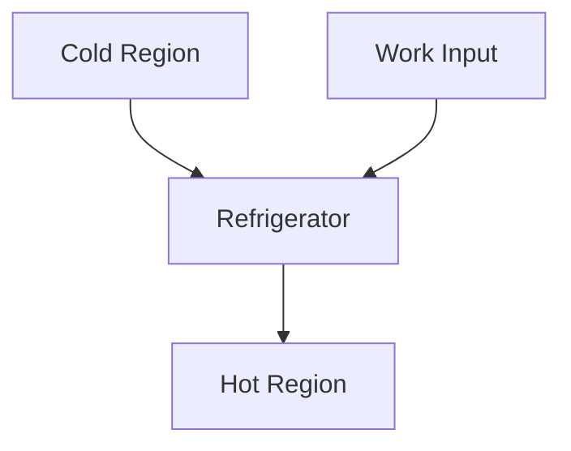
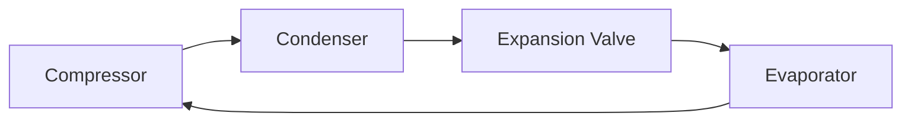
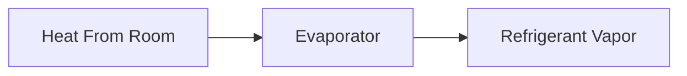
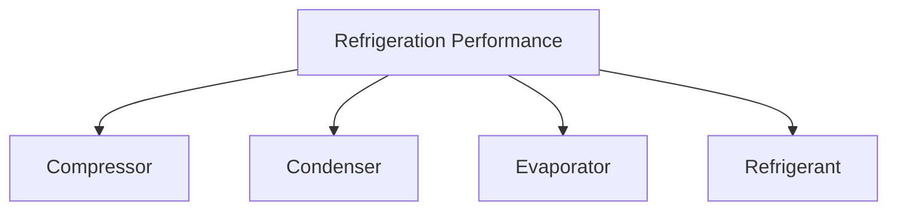

# ❄ Refrigeration

Refrigeration is the process of removing heat from a low-temperature region and
transferring it to a high-temperature region.

In nature, heat flows from a hot body to a cold body. Refrigeration does the
opposite, so it requires external work.

Examples of refrigeration systems include:

- 🧊 Refrigerators
- ❄️ Air Conditioners
- 🏪 Cold Storage Units
- 🏭 Industrial Cooling Systems
- 💻 Computer Cooling Systems

---

## What is Refrigeration?

Refrigeration is the artificial cooling of a space or substance below the
surrounding temperature.

The primary objective is to maintain a low temperature by continuously removing
heat.

### Example

A refrigerator removes heat from food and rejects it to the kitchen environment.

<!-- Visual flow for ❄ Refrigeration. -->


## 🌡 Why is Refrigeration Needed?

Refrigeration helps:

- Preserve food
- Store medicines
- Improve comfort
- Cool industrial equipment
- Maintain low temperatures for scientific applications

## ⚙ Working Principle of Refrigeration

A refrigeration system transfers heat from a cold region to a hot region by
consuming work.

According to the Second Law of Thermodynamics:

**Heat cannot naturally flow from a colder body to a hotter body without
external work.**

<!-- Visual flow for ❄ Refrigeration. -->


## 🧊 Refrigeration Cycle

Most refrigeration systems operate on a cycle.

The refrigerant continuously circulates through four main components:

1. Compressor
2. Condenser
3. Expansion Valve
4. Evaporator

<!-- Visual flow for ❄ Refrigeration. -->


## 1⃣ Compressor

The compressor increases the pressure and temperature of the refrigerant vapor.

### Functions

- Compresses low-pressure vapor
- Raises pressure
- Raises temperature
- Circulates refrigerant

<!-- Visual flow for ❄ Refrigeration. -->


## 2⃣ Condenser

The condenser rejects heat to the surroundings.

During this process:

- Refrigerant loses heat
- Vapor converts into liquid

<!-- Visual flow for ❄ Refrigeration. -->


## 3⃣ Expansion Valve

The expansion valve reduces refrigerant pressure suddenly.

Results:

- Pressure drops
- Temperature drops

<!-- Visual flow for ❄ Refrigeration. -->


## 4⃣ Evaporator

The evaporator absorbs heat from the refrigerated space.

Inside the evaporator:

- Refrigerant evaporates
- Heat is absorbed
- Cooling effect is produced

<!-- Visual flow for ❄ Refrigeration. -->


## Vapor Compression Refrigeration Cycle

The Vapor Compression Cycle is the most widely used refrigeration cycle.


#### Step 1

Low-pressure vapor enters the compressor.

#### Step 2

The compressor raises pressure and temperature.

#### Step 3

The condenser rejects heat to surroundings.

#### Step 4

Liquid refrigerant passes through the expansion valve.

#### Step 5

Pressure drops significantly.

#### Step 6

The evaporator absorbs heat from the cooled space.

#### Step 7

The refrigerant returns to the compressor.

The cycle repeats continuously.

## 🌡 Refrigerant

A refrigerant is the working fluid used in refrigeration systems.

A good refrigerant should have:

- High latent heat
- Low toxicity
- Chemical stability
- Non-corrosive properties
- Environmental safety

### Common Refrigerants

| Refrigerant   | Common Name                      |
| ------------- | -------------------------------- |
| R-134a        | Automotive Refrigerant           |
| R-410A        | Air Conditioning Refrigerant     |
| R-32          | Modern AC Refrigerant            |
| Ammonia (NH₃) | Industrial Refrigeration         |
| CO₂           | Environment-Friendly Refrigerant |

## Coefficient of Performance (COP)

Unlike heat engines, refrigeration systems are evaluated using COP.

## Refrigeration COP

```
COP_R = QL / W
```

Where:

- COP_R = Coefficient of Performance
- QL = Heat Removed from Cold Space
- W = Work Input

### Interpretation

Higher COP means:

- Better efficiency
- Lower power consumption

## 🧮 Example

Suppose:

- Heat removed = 300 kJ
- Work supplied = 100 kJ

Then:

```
COP = 300 / 100
```

```
COP = 3
```

### Result

For every 1 kJ of work input, the system removes 3 kJ of heat.

## ❄ Refrigerator vs Heat Pump

Both operate on the same principle.

The difference is the desired effect.

| Device       | Desired Output |
| ------------ | -------------- |
| Refrigerator | Cooling Effect |
| Heat Pump    | Heating Effect |

<!-- Visual flow for ❄ Refrigeration. -->


- Refrigerator focuses on heat removal from the cold region.
- Heat pump focuses on heat delivery to the hot region.

## 🏠 Domestic Refrigeration

- Home refrigerators
- Deep freezers

## ❄ Air Conditioning

- Homes
- Offices
- Shopping malls

## 🏭 Industrial Refrigeration

- Food processing
- Chemical plants
- Cold storage facilities

## 🏥 Medical Applications

- Vaccine storage
- Blood banks
- Pharmaceutical preservation

## 💻 Electronics Cooling

- Data centers
- Computer processors
- Industrial control systems

## ⚠ Factors Affecting Performance

Performance depends on:

- Compressor efficiency
- Refrigerant properties
- Condenser performance
- Evaporator effectiveness
- Ambient temperature

<!-- Visual flow for ❄ Refrigeration. -->


## Heat Engine vs Refrigeration System

| Feature             | Heat Engine  | Refrigeration System |
| ------------------- | ------------ | -------------------- |
| Main Objective      | Produce Work | Produce Cooling      |
| Work                | Output       | Input                |
| Heat Flow           | Hot → Cold   | Cold → Hot           |
| Performance Measure | Efficiency   | COP                  |

## Key Points

✅ Refrigeration removes heat from a low-temperature region.

✅ Heat is transferred to a higher-temperature region.

✅ External work is required.

✅ The Vapor Compression Cycle is the most common refrigeration cycle.

✅ Main components are compressor, condenser, expansion valve, and evaporator.

✅ Performance is measured using COP.

✅ Refrigeration is widely used in homes, industries, medicine, and air
conditioning.

## 📚 Quick Summary

Refrigeration is the process of transferring heat from a cold region to a hot
region using external work. Most refrigeration systems operate on the Vapor
Compression Cycle, which consists of a compressor, condenser, expansion valve,
and evaporator. Refrigeration is essential for food preservation, air
conditioning, industrial cooling, and medical storage.

## Quick Reference

| Area | Revision point |
|---|---|
| Definition | State exactly what the topic means. |
| Mechanism | Explain the steps that produce the result. |
| Example | Use a small realistic case. |
| Pitfalls | Know common mistakes and boundary cases. |
