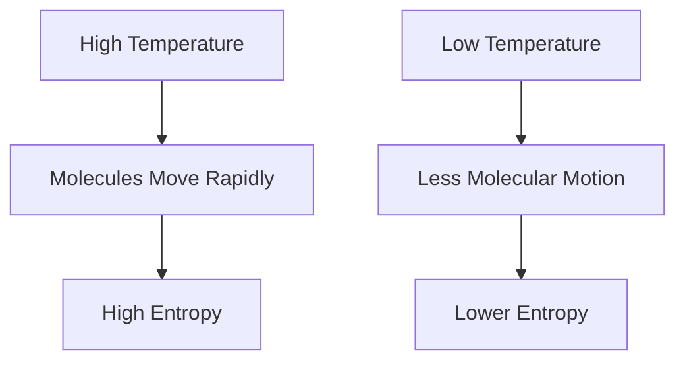
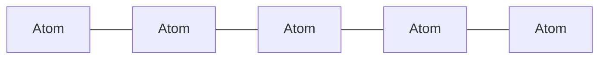
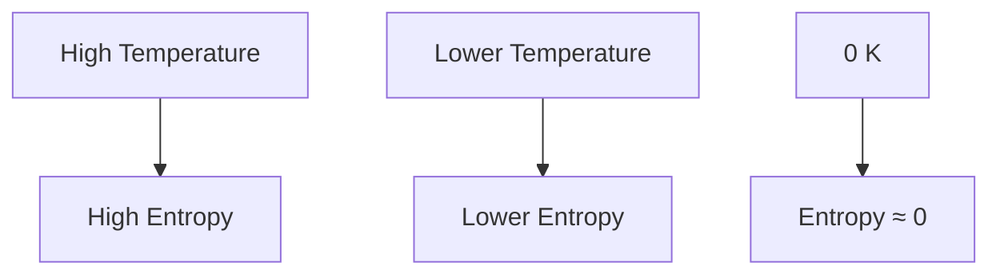

# 3⃣ Third Law of Thermodynamics

The Third Law of Thermodynamics describes the behavior of substances at
extremely low temperatures. It establishes an important relationship between
**temperature** and **entropy**.

This law states that as the temperature of a perfectly crystalline substance
approaches **absolute zero**, its entropy approaches zero.

## Statement of the Third Law

**The entropy of a perfect crystal becomes zero at absolute zero temperature (0
K).**

Mathematically:

S = 0 at T = 0 K

Where:

- S = Entropy
- T = Absolute Temperature

## 🌡 What is Absolute Zero?

Absolute zero is the lowest possible temperature.

```
0 K = -273.15°C
```

At this temperature:

- Molecular motion becomes minimal.
- Thermal energy is at its lowest value.
- Entropy approaches its minimum value.

## 📉 Entropy Near Absolute Zero

As temperature decreases:

- Molecular movement decreases.
- Randomness decreases.
- Entropy decreases.

<!-- Visual flow for 3⃣ Third Law of Thermodynamics. -->


## 🧊 Perfect Crystal Concept

A perfect crystal is an ideal substance in which:

- Atoms are perfectly arranged.
- No defects exist.
- Only one possible arrangement exists.

Because there is only one arrangement:

- Disorder is zero.
- Entropy becomes zero at 0 K.

### Perfect Crystal Representation

<!-- Visual flow for 3⃣ Third Law of Thermodynamics. -->


## 🔬 Why Absolute Zero Cannot Be Reached

Although scientists can approach absolute zero, it cannot be reached exactly.

As temperature gets closer to 0 K:

- Cooling becomes increasingly difficult.
- More effort is required for smaller temperature reductions.
- Infinite steps would be needed to reach exactly 0 K.

Therefore:

**Absolute zero is unattainable in practice.**

## 🌍 Physical Meaning

At ordinary temperatures:

- Molecules vibrate continuously.
- Entropy exists due to molecular randomness.

Near absolute zero:

- Molecular motion becomes extremely small.
- Entropy approaches a minimum value.

The system becomes highly ordered.

## Temperature vs Entropy

<!-- Visual flow for 3⃣ Third Law of Thermodynamics. -->


## ⚙ Residual Entropy

Some substances may still possess entropy near absolute zero.

This occurs when:

- Multiple molecular arrangements are possible.
- Perfect ordering is not achieved.

This remaining entropy is called **Residual Entropy**.

### Example

Certain crystals can have more than one stable molecular orientation even at
very low temperatures.

## Importance of the Third Law

The Third Law provides:

- A reference point for entropy calculations.
- Accurate thermodynamic property evaluation.
- Better understanding of low-temperature phenomena.

It allows scientists to determine the absolute entropy of substances.

## ❄ Cryogenics

Cryogenics is the study of materials at extremely low temperatures.

Applications include:

- Superconductors
- Space research
- Medical preservation
- Quantum computing

The Third Law plays a major role in cryogenic engineering.

## Superconductivity

At very low temperatures, some materials lose all electrical resistance.

Benefits:

- Zero power loss
- High efficiency
- Powerful electromagnets

Applications:

- MRI machines
- Particle accelerators
- Maglev trains

## 🛰 Space Technology

Many spacecraft instruments operate at extremely low temperatures.

Understanding entropy behavior at low temperatures helps engineers design:

- Infrared detectors
- Space telescopes
- Cryogenic fuel systems

### ❄ Refrigeration Systems

Used in the design of ultra-low-temperature refrigeration systems.

### Superconducting Devices

Helps analyze materials operating near absolute zero.

### Material Science

Used to study crystal structures and phase transitions.

### 🛰 Aerospace Engineering

Important for cryogenic fuels such as liquid hydrogen and liquid oxygen.

## Comparison of Thermodynamic Laws

| Law        | Main Idea                                   |
| ---------- | ------------------------------------------- |
| Zeroth Law | Defines temperature and thermal equilibrium |
| First Law  | Energy is conserved                         |
| Second Law | Entropy increases and limits efficiency     |
| Third Law  | Entropy approaches zero at absolute zero    |

### Absolute Zero Means No Energy

Not completely.

Quantum effects still exist, and some microscopic motion remains.

### Entropy Always Becomes Exactly Zero

Only a perfect crystal can have zero entropy at 0 K.

Real substances may retain residual entropy.

### Absolute Zero Can Be Reached

It can be approached closely but cannot be achieved exactly.

## Key Points

✅ Third Law relates entropy to temperature.

✅ Entropy of a perfect crystal becomes zero at 0 K.

✅ Absolute zero is the lowest possible temperature.

✅ Absolute zero cannot be reached in practice.

✅ Molecular disorder decreases as temperature decreases.

✅ The law provides a reference point for entropy calculations.

## 📚 Quick Summary

The Third Law of Thermodynamics states that the entropy of a perfect crystal
approaches zero as temperature approaches absolute zero (0 K). It explains the
behavior of matter at extremely low temperatures and forms the foundation of
cryogenics, superconductivity, and low-temperature thermodynamic analysis.

## Quick Reference

| Area | Revision point |
|---|---|
| Definition | State exactly what the topic means. |
| Mechanism | Explain the steps that produce the result. |
| Example | Use a small realistic case. |
| Pitfalls | Know common mistakes and boundary cases. |
