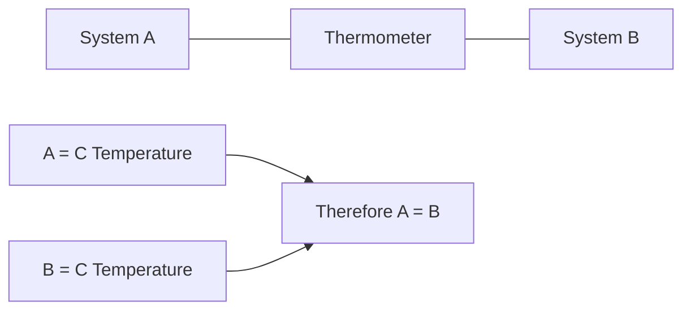
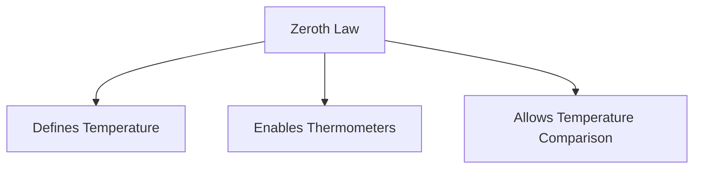
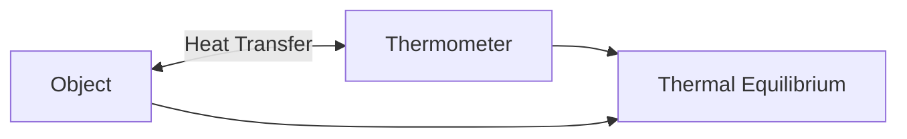
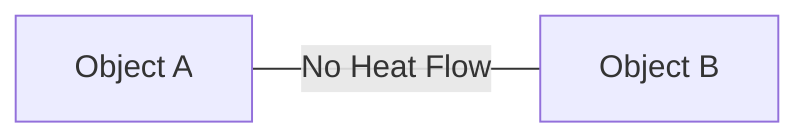

# 0⃣ Zeroth Law of Thermodynamics

The Zeroth Law of Thermodynamics is one of the most fundamental laws in
thermodynamics. It introduces the concept of **temperature** and explains how we
can determine whether two objects are at the same temperature.

Although it was discovered after the First and Second Laws, it was considered
more fundamental and was therefore named the **Zeroth Law**.

---

## Statement of Zeroth Law

**If two systems are each in thermal equilibrium with a third system, then they
are in thermal equilibrium with each other.**

In simple words:

If:

- System A has the same temperature as System C
- System B has the same temperature as System C

Then:

- System A and System B must have the same temperature

## 🌡 Understanding Thermal Equilibrium

Thermal equilibrium occurs when two bodies in contact stop exchanging heat.

At thermal equilibrium:

- Temperature becomes equal
- No net heat transfer occurs
- Thermal conditions remain constant

### Diagram

<!-- Visual flow for 0⃣ Zeroth Law of Thermodynamics. -->


## ☕ Everyday Example

Imagine:

- A cup of hot coffee
- A thermometer
- A glass of warm water

Step 1: Place the thermometer in the coffee.

Eventually, the thermometer reaches thermal equilibrium with the coffee.

Step 2: Place the same thermometer in the warm water.

The thermometer shows the same reading.

Since both the coffee and water are in thermal equilibrium with the thermometer,
the Zeroth Law tells us that:

**The coffee and water are at the same temperature.**

## 🌡 Why Is This Law Important?

Without the Zeroth Law:

- Temperature could not be defined properly.
- Thermometers would not work reliably.
- Comparing temperatures would be impossible.

The law provides the scientific basis for temperature measurement.

<!-- Visual flow for 0⃣ Zeroth Law of Thermodynamics. -->


## Role of Thermometers

A thermometer acts as the third system in the Zeroth Law.

When placed in contact with an object:

1. Heat flows between the object and thermometer.
2. Temperatures become equal.
3. Thermal equilibrium is reached.
4. The thermometer displays the temperature.

<!-- Visual flow for 0⃣ Zeroth Law of Thermodynamics. -->


## 🔥 Heat Transfer Before Equilibrium

When two objects have different temperatures:

- Heat flows from higher temperature to lower temperature.
- Temperature gradually changes.
- Equilibrium is eventually reached.

<!-- Visual flow for 0⃣ Zeroth Law of Thermodynamics. -->


After equilibrium:

<!-- Visual flow for 0⃣ Zeroth Law of Thermodynamics. -->


## Mathematical Representation

```
T_A = T_C
```

and

```
T_B = T_C
```

then

```
T_A = T_B
```

Where:

- T_A = Temperature of System A
- T_B = Temperature of System B
- T_C = Temperature of System C

This simple relation forms the foundation of temperature measurement.

## 🌡 Temperature Measurement

Used in:

- Clinical thermometers
- Digital thermometers
- Laboratory thermometers
- Industrial sensors

## 🚗 Automobile Systems

Engine temperature sensors rely on thermal equilibrium to measure engine
temperature accurately.

## ❄ Refrigeration and Air Conditioning

Temperature sensors continuously compare temperatures and regulate cooling
systems.

## 🏭 Industrial Processes

- Boilers
- Heat exchangers
- Furnaces
- Chemical reactors

to monitor and control temperature.

## Practical Example

Suppose:

- A metal block has unknown temperature.
- A thermometer is placed on the block.

After a few minutes:

- Thermometer reads 80°C.
- Thermometer and block are in thermal equilibrium.

Therefore:

```
Temperature of block = 80°C
```

This conclusion is valid because of the Zeroth Law.

## ⚖ Thermal Equilibrium vs Heat Transfer

| Condition              | Heat Transfer    |
| ---------------------- | ---------------- |
| Temperatures Different | Yes              |
| Temperatures Equal     | No               |
| Thermal Equilibrium    | No Net Heat Flow |
| Zeroth Law Satisfied   | Yes              |

## Key Points

✅ Zeroth Law introduces the concept of temperature.

✅ It establishes the idea of thermal equilibrium.

✅ It makes thermometers possible.

✅ No heat transfer occurs during thermal equilibrium.

✅ If two systems have the same temperature as a third system, they must have
the same temperature as each other.

## Quick Summary

The Zeroth Law of Thermodynamics states that if two systems are separately in
thermal equilibrium with a third system, they are also in thermal equilibrium
with each other. This law forms the foundation of temperature measurement and
explains how thermometers accurately determine temperature.

## Quick Reference

| Area | Revision point |
|---|---|
| Definition | State exactly what the topic means. |
| Mechanism | Explain the steps that produce the result. |
| Example | Use a small realistic case. |
| Pitfalls | Know common mistakes and boundary cases. |
