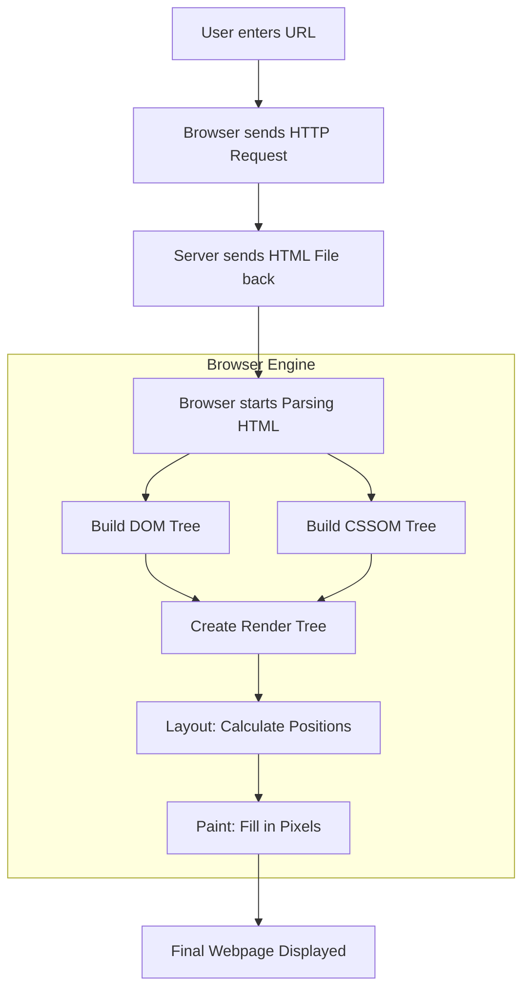

# Introduction

**HTML (HyperText Markup Language)** is the standard language used to create and
structure content on the web. Every website you see in a browser is built on
HTML. It defines **what content exists** on a page—such as headings, paragraphs,
images, links, forms, and tables—and **how that content is organized**.

HTML is a **markup language**, not a programming language. That means it doesn’t
handle logic, calculations, or interactions. Instead, it uses **tags** to label
content so browsers know how to display it. For example, a heading is marked
with `<h1>`, a paragraph with `
`, and a link with `<a>`.

HTML works alongside other core web technologies:

- **CSS** controls the look and layout
- **JavaScript** adds behavior and interactivity

Modern HTML also focuses on **semantic structure**, using meaningful tags like
`<header>`, `<nav>`, `<main>`, and `<footer>`. This improves accessibility,
search engine optimization, and overall code clarity.

In short, HTML is the **foundation of the web**. Without it, there is no
structure for styling or interactivity to exist on.

### The Lifecycle of an HTML Request

The process involves several layers: the **Request** (fetching the file), the
**Parsing** (reading the code), and the **Rendering** (drawing the page).

---

### Breaking Down the Stages

1.  **The DOM (Document Object Model) Tree**: As the browser reads your HTML, it
    creates a tree-like structure. Every tag (like `
` or `
`) becomes a
    "node" in this tree. This allows the browser to understand the relationship
    between elements (e.g., a list item is a "child" of a list).

2.  **The CSSOM (CSS Object Model) Tree**: While the HTML is being parsed, the
    browser also looks for CSS. It builds a separate tree for styles to
    determine how those HTML nodes should look (colors, fonts, sizes).

3.  **The Render Tree**: The browser combines the DOM and CSSOM. It ignores
    things that aren't visible (like `<script>` tags or elements with
    `display: none`) and focuses only on what needs to be drawn.

4.  **Layout & Paint**:
    - **Layout**: The browser calculates exactly where every element sits on the
      screen based on the viewport size (your screen width).
    - **Paint**: Finally, it converts the layout into actual pixels on your
      screen. This includes drawing text, colors, images, and borders.

### A Quick Reality Check

It’s a common misconception that HTML "does" everything. In reality, **HTML is
just the structure.** If a website were a house, HTML is the framing and walls,
CSS is the paint and decor, and JavaScript is the electricity and plumbing that
makes things move.
