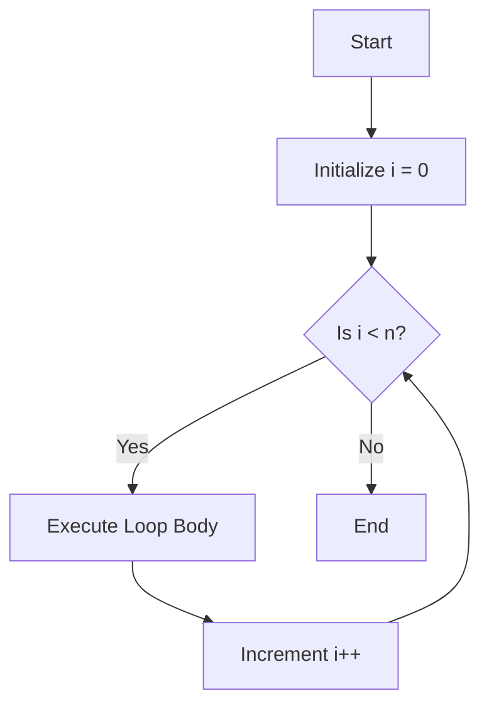
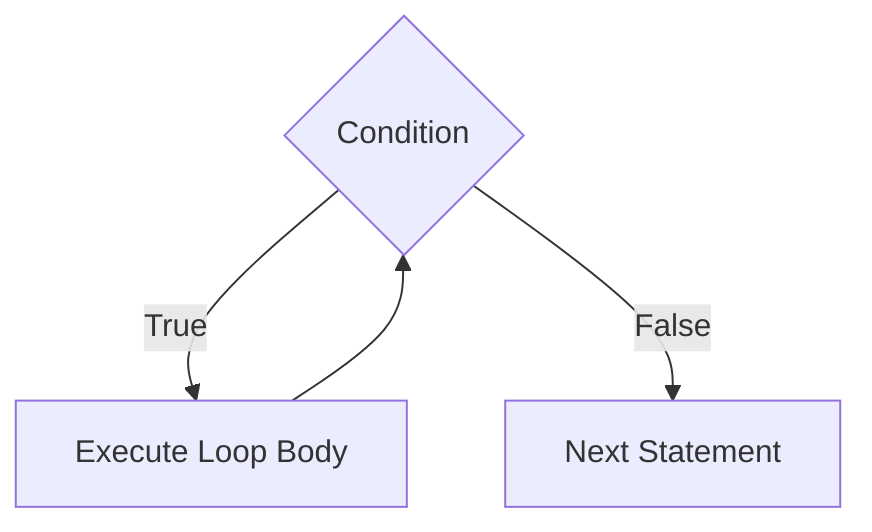
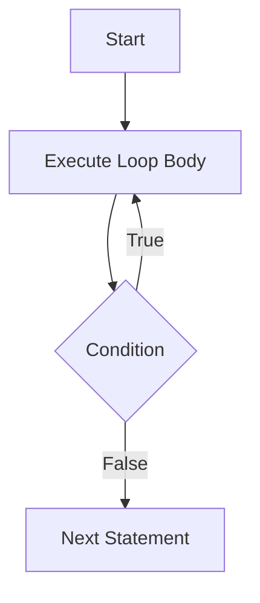
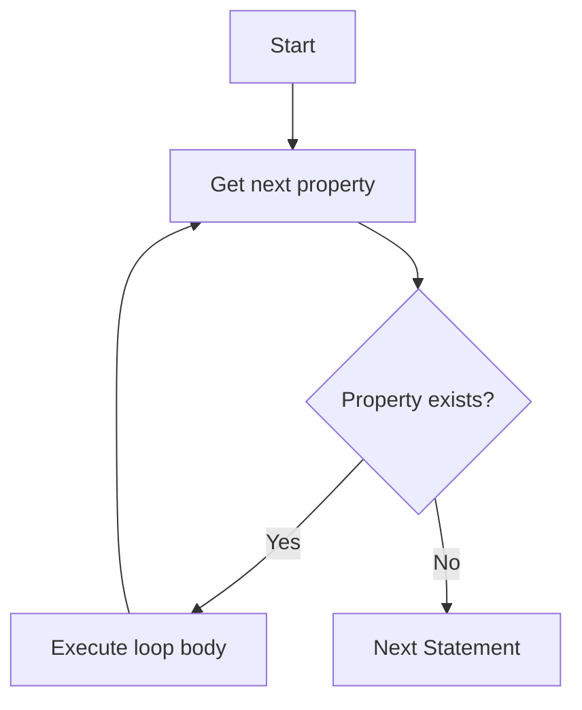
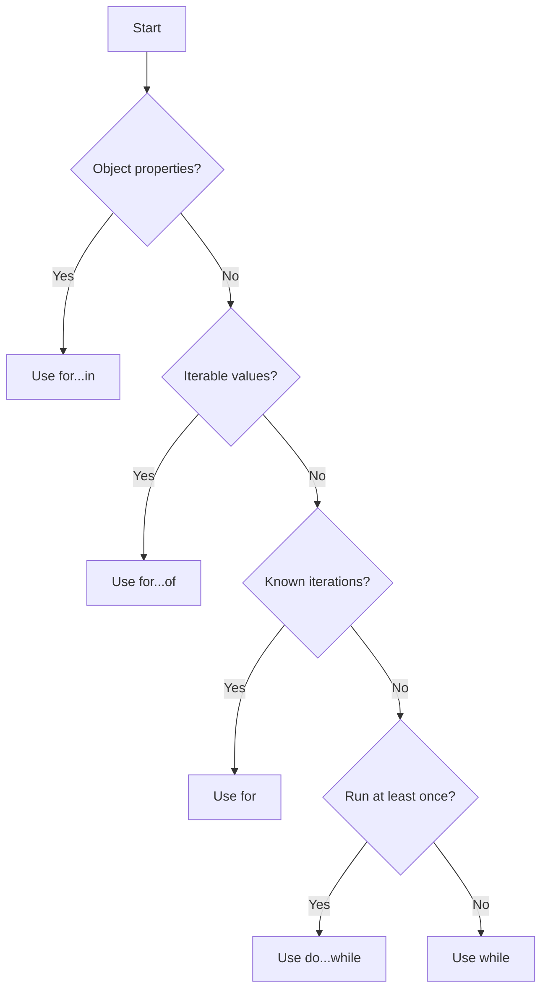

# 🔁 Looping Statements: Complete Guide

## 1. For Loop 🔢

The `for` loop is the most commonly used loop when you know the number of
iterations beforehand.

### 📝 Syntax

```javascript
for (initialization; condition; increment / decrement) {
  // code to be executed
}
```

### 🔄 Flow Diagram



### 💡 Example

```javascript
for (let i = 0; i < 5; i++) {
  console.log(`Iteration: ${i}`);
}
```

### 📊 Execution Table

| Step | i Value | Condition (i < 5) | Action              | Output         |
| ---- | ------- | ----------------- | ------------------- | -------------- |
| 1    | 0       | ✅ true            | Execute & increment | "Iteration: 0" |
| 2    | 1       | ✅ true            | Execute & increment | "Iteration: 1" |
| 3    | 2       | ✅ true            | Execute & increment | "Iteration: 2" |
| 4    | 3       | ✅ true            | Execute & increment | "Iteration: 3" |
| 5    | 4       | ✅ true            | Execute & increment | "Iteration: 4" |
| 6    | 5       | ❌ false           | Exit loop           | -              |

---

## 2. While Loop 🔄

The `while` loop executes code as long as a specified condition is true.

### 📝 Syntax

```javascript
while (condition) {
  // code to be executed
  // update condition variable
}
```

### 🔄 Flow Diagram



### 💡 Example

```javascript
let count = 0;
while (count < 3) {
  console.log(`Count: ${count}`);
  count++;
}
```

### 📊 Execution Table

| Step | count Value | Condition (count < 3) | Action              | Output     |
| ---- | ----------- | --------------------- | ------------------- | ---------- |
| 1    | 0           | ✅ true                | Execute & increment | "Count: 0" |
| 2    | 1           | ✅ true                | Execute & increment | "Count: 1" |
| 3    | 2           | ✅ true                | Execute & increment | "Count: 2" |
| 4    | 3           | ❌ false               | Exit loop           | -          |

---

## 3. Do-While Loop 🔂

The `do-while` loop executes code at least once, then continues while a
condition is true.

### 📝 Syntax

```javascript
do {
  // code to be executed
  // update condition variable
} while (condition);
```

### 🔄 Flow Diagram



### 💡 Example

```javascript
let num = 0;
do {
  console.log(`Number: ${num}`);
  num++;
} while (num < 2);
```

### 📊 Execution Table

| Step | num Value | Action          | Output      | Condition (num < 2) |
| ---- | --------- | --------------- | ----------- | ------------------- |
| 1    | 0         | Execute first   | "Number: 0" | ✅ true (continue)   |
| 2    | 1         | Execute         | "Number: 1" | ✅ true (continue)   |
| 3    | 2         | Check condition | -           | ❌ false (exit)      |

---

## 4. For...In Loop 🗝️

The `for...in` loop iterates over enumerable properties of an object.

### 📝 Syntax

```javascript
for (variable in object) {
  // code to be executed
}
```

### 💡 Example

```javascript
const person = {
  name: 'Alice',
  age: 30,
  city: 'New York',
};

for (let key in person) {
  console.log(`${key}: ${person[key]}`);
}
```

### 🔄 Flow Diagram



### 📊 Iteration Table

| Iteration | Key    | Value      | Output           |
| --------- | ------ | ---------- | ---------------- |
| 1         | "name" | "Alice"    | "name: Alice"    |
| 2         | "age"  | 30         | "age: 30"        |
| 3         | "city" | "New York" | "city: New York" |

---

## 5. For...Of Loop 🍏

The `for...of` loop iterates over iterable objects (arrays, strings, etc.).

### 📝 Syntax

```javascript
for (variable of iterable) {
  // code to be executed
}
```

### 💡 Example

```javascript
const fruits = ['apple', 'banana', 'orange'];

for (let fruit of fruits) {
  console.log(fruit);
}
```

### 🔄 Flow Diagram


### 📊 Iteration Table

| Iteration | Index | Value    | Output   |
| --------- | ----- | -------- | -------- |
| 1         | 0     | "apple"  | "apple"  |
| 2         | 1     | "banana" | "banana" |
| 3         | 2     | "orange" | "orange" |

---

## 🧭 Flowchart: Choosing the Right Loop



---

## 🆚 Loop Comparison Table

| Loop Type  | Best Used For                       | Pre-condition Check   | Minimum Executions |
| ---------- | ----------------------------------- | --------------------- | ------------------ |
| `for`      | Known number of iterations          | ✅ Yes                 | 0                  |
| `while`    | Unknown iterations, condition-based | ✅ Yes                 | 0                  |
| `do-while` | At least one execution needed       | ❌ No (post-condition) | 1                  |
| `for...in` | Object property iteration           | N/A                   | 0                  |
| `for...of` | Array/iterable iteration            | N/A                   | 0                  |

---

## ⚡ Performance Comparison

```text
Speed (fastest to slowest):
1. for loop
2. while loop
3. for...of loop
4. do-while loop
5. for...in loop
```

---

## ⏹️ Loop Control Statements

### 🛑 Break Statement

```javascript
for (let i = 0; i < 10; i++) {
  if (i === 5) break;
  console.log(i);
}
```

### ⏭️ Continue Statement

```javascript
for (let i = 0; i < 5; i++) {
  if (i === 2) continue;
  console.log(i);
}
```

---

## 🔗 Nested Loops Example

```javascript
for (let i = 1; i <= 3; i++) {
  for (let j = 1; j <= 3; j++) {
    console.log(`${i} × ${j} = ${i * j}`);
  }
}
```

---

## 👍 Best Practices

✅ **Do:**

* Use `for` loops when you know the iteration count
* Use `for...of` for arrays and iterables
* Use `for...in` for object properties
* Always update the condition variable in `while` loops

❌ **Don't:**

* Forget to update counters in `while` loops (infinite loops)
* Modify arrays during `for...in` iteration
* Use `for...in` with arrays (use `for...of` instead)
